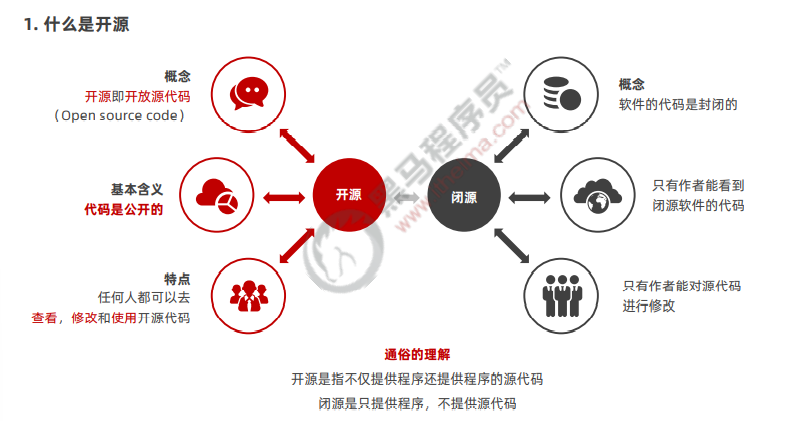
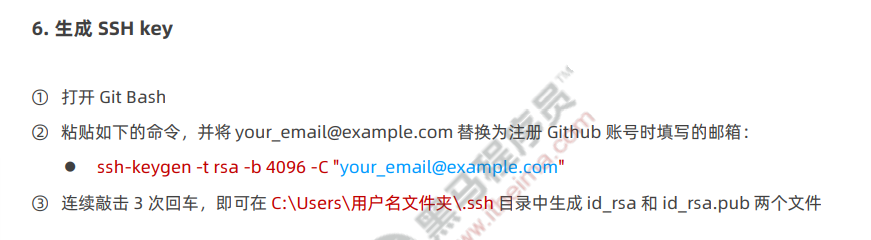
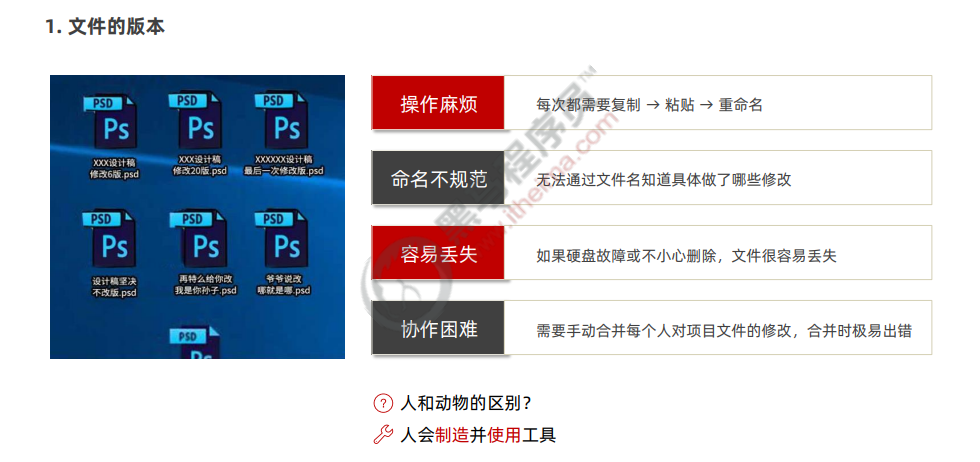

# Git

## Github

- Github 是全球最大的开源项目托管平台。因为只支持 Git 作为唯一的版本控制工具，故名 GitHub。
- 在 Github 中，你可以：
  ① 关注自己喜欢的开源项目，为其点赞打 call
  ② 为自己喜欢的开源项目做贡献（Pull Request）
  ③ 和开源项目的作者讨论 Bug 和提需求 （Issues）
  ④ 把喜欢的项目复制一份作为自己的项目进行修改（Fork）
  ⑤ 创建属于自己的开源项目
  ⑥ etc…
  So，Github ≠ Git

### 开源及许可协议

- 开源并不意味着完全没有限制，为了限制使用者的使用范围和保护作者的权利，每个开源项目都应该遵守开源许可协议（ Open Source License ）：

  - ① BSD（Berkeley Software Distribution）
  - ② Apache Licence 2.0
  - ③ GPL（GNU General Public License）
    - 具有传染性的一种开源协议，不允许修改后和衍生的代码做为闭源的商业软件发布和销售
    - 使用 GPL 的最著名的软件项目是：Linux
  - ④ LGPL（GNU Lesser General Public License）
  - ⑤ MIT（Massachusetts Institute of Technology, MIT） - 是目前限制最少的协议，唯一的条件：在修改后的代码或者发行包中，必须包含原作者的许可信息 - 使用 MIT 的软件项目有：jquery、Node.js

 

- 开源的核心思想是“我为人人，人人为我”，人们越来越喜欢开源大致是出于以下 3 个原因：
  - ① 开源给使用者更多的控制权
  - ② 开源让学习变得容易
  - ③ 开源才有真正的安全
- 开源是软件开发领域的大趋势，拥抱开源就像站在了巨人的肩膀上，不用自己重复造轮子，让开发越来越容易。

### 开源项目托管平台

- 专门用于免费存放开源项目源代码的网站，叫做开源项目托管平台。目前世界上比较出名的开源项目托管平台
  主要有以下 3 个：
  - Github（全球最牛的开源项目托管平台，没有之一）
  - Gitlab（对代码私有性支持较好，因此企业用户较多）
  - Gitee（又叫做码云，是国产的开源项目托管平台。访问速度快、纯中文界面、使用友好）
- 注意：以上 3 个开源项目托管平台，只能托管以 Git 管理的项目源代码，因此，它们的名字都以 Git 开头。

### Github 使用教程

## 版本控制

### 版本控制系统的分类

## Git 概念

- Git 是一个开源的分布式版本控制系统，是目前世界上最先进、最流行的版本控制系统。可以快速高效地处理从很小到非常大的项目版本管理。
- 特点：项目越大越复杂，协同开发者越多，越能体现出 Git 的高性能和高可用性！

### Git 的特性

- Git 之所以快速和高效，主要依赖于它的如下两个特性：
  - 直接记录快照，而非差异比较
  - 近乎所有操作都是本地执行

### SVN 的差异比较

### Git 的记录快照

### 近乎所有操作都是本地执行

### Git 中的三个区域

### Git 中的三种状态

### 基本的 Git 工作流程

## 安装并配置 Git

## Git 的基本操作

### 获取 Git 仓库的两种方式

> 将尚未进行版本控制的本地目录转换为 Git 仓库
> 从其它服务器克隆一个已存在的 Git 仓库

- 以上两种方式都能够在自己的电脑上得到一个可用的 Git 仓库

### 在现有目录中初始化仓库

- 如果自己有一个尚未进行版本控制的项目目录，想要用 Git 来控制它，需要执行如下两个步骤：

  - 在项目目录中，通过鼠标右键打开“Git Bash”
  - 执行 git init 命令将当前的目录转化为 Git 仓库

- git init 命令会创建一个名为 .git 的隐藏目录，这个 .git 目录就是当前项目的 Git 仓库，里面包含了初始的必要
  文件，这些文件是 Git 仓库的必要组成部分。

### 工作区中文件的 4 种状态

### 以精简的方式显示文件状态

### 跟踪新文件

### 提交更新

### 对已提交的文件进行修改

### 暂存已修改的文件

### 提交已暂存的文件

### 撤销对文件的修改

### 向暂存区中一次性添加多个文件

### 取消暂存的文件

### 跳过使用暂存区域

### 移除文件

### 忽略文件

### glob 模式

### .gitignore 文件

### 查看提交历史

### 回退到指定的版本

### Git 操作小结

- 初始化 Git 仓库的命令
  - git init
- 查看文件状态的命令
  - git status 或 git status -s
- 一次性将文件加入暂存区的命令
  - git add .
- 将暂存区的文件提交到 Git 仓库的命令
  - git commit -m "提交消息"

## Git 分支

### 本地分支操作

### 远程分支操作

### Git 分支总结

- 能够掌握 Git 中基本命令的使用
  - git init
  - git add .
  - git commit –m "提交消息"
  - git status 和 git status -s
- 能够使用 Github 创建和维护远程仓库
  - 能够配置 Github 的 SSH 访问
  - 能够将本地仓库上传到 Github
- 能够掌握 Git 分支的基本使用
  - git checkout -b 新分支名称
  - git push -u origin 新分支名称
  - git checkout 分支名称
  - git branch
