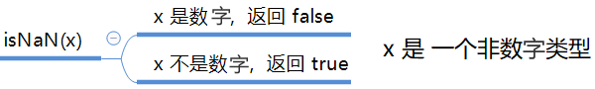
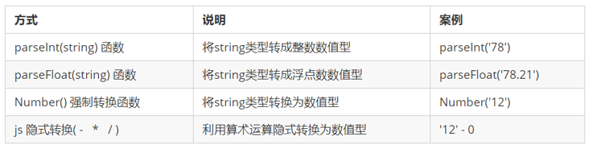
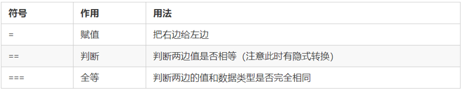
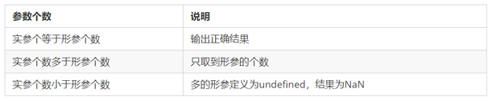
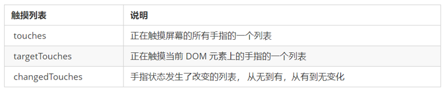
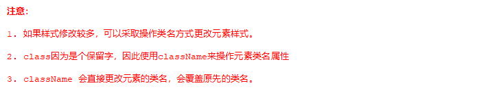
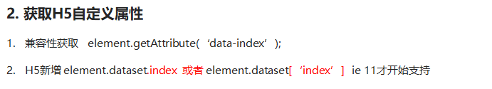
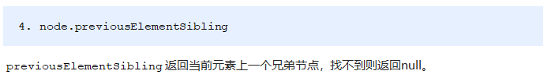
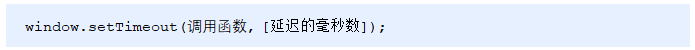

# JavaScript

## JavaScript 基础


- JavaScript 是世界上最流行的语言之一，是一种运行在客户端的脚本语言 （Script 是脚本的意思）
- 脚本语言：不需要编译，运行过程中由 js 解释器( js 引擎）逐行来进行解释并执行
- 现在也可以基于 Node.js 技术进行服务器端编程

### JavaScript 的作用

- 表单动态校验（密码强度检测） （ JS 产生最初的目的 ）
- 网页特效
- 服务端开发(Node.js)
- 桌面程序(Electron)
- App(Cordova)
- 控制硬件-物联网(Ruff)
- 游戏开发(cocos2d-js)

### 浏览器执行 JavaScript

**浏览器分成两部分：渲染引擎和 JS 引擎**


> 浏览器本身并不会执行 JS 代码，而是通过内置 JavaScript 引擎(解释器) 来执行 JS 代码 。JS 引擎执行代码时逐行解释每一句源码（转换为机器语言），然后由计算机去执行，所以 JavaScript 语言归为脚本语言，会逐行解释执行。

### JavaScript 的组成


**ECMAScript**

    ​		ECMAScript 是由ECMA 国际（ 原欧洲计算机制造商协会）进行标准化的一门编程语言，这种语言在万维网上应用广泛，它往往被称为 JavaScript或 JScript，但实际上后两者是 ECMAScript 语言的实现和扩展。


    ​ ECMAScript：规定了 JS 的编程语法和基础核心知识，是所有浏览器厂商共同遵守的一套 JS 语法工业标准。

    更多参看 MDN: [MDN 手册](https://developer.mozilla.org/zh-CN/docs/Web/JavaScript/JavaScript_technologies_overview)

**DOM——文档对象模型**

    ​ **文档对象模型**（DocumentObject Model，简称 DOM），是 W3C 组织推荐的处理可扩展标记语言的标准编程接口。通过 DOM 提供的接口可以对页面上的各种元素进行操作（大小、位置、颜色等）

**BOM——浏览器对象模型**

    ​ **浏览器对象模型**(Browser Object Model，简称 BOM) 是指浏览器对象模型，它提供了独立于内容的、可以与浏览器窗口进行互动的对象结构。通过 BOM 可以操作浏览器窗口，比如弹出框、控制浏览器跳转、获取分辨率等。

### JavaScript 输入输出语句

为了方便信息的输入输出，JS 中提供了一些输入输出语句，其常用的语句如下：

| 方法             | 说明                           | 归属   |
| ---------------- | ------------------------------ | ------ |
| alert(msg)       | 浏览器弹出警示框               | 浏览器 |
| console.log(msg) | 浏览器控制台打印输出信息       | 浏览器 |
| prompt(info)     | 浏览器弹出输入框，用户可以输入 | 浏览器 |

- 注意：alert() 主要用来显示消息给用户，console.log() 用来给程序员自己看运行时的消息。

## 变量的概念

    本质：变量是程序在内存中申请的一块用来存放数据的空间。

| 情况                         | 说明                   | 结果      |
| ---------------------------- | ---------------------- | --------- |
| var age ; console.log (age); | 只声明 不赋值          | undefined |
| console.log(age)             | 不声明 不赋值 直接使用 | 报错      |
| age = 10; console.log (age); | 不声明 只赋值          | 10        |

### 变量命名规范

- 由字母(A-Za-z)、数字(0-9)、下划线(\_)、美元符号( $ )组成，如：usrAge, num01, \_name
- 严格区分大小写。var app; 和 var App; 是两个变量
- 不能 以数字开头。 18age 是错误的
- 不能 是关键字、保留字。例如：var、for、while
- 变量名必须有意义。 MMD BBD nl → age
- 遵守驼峰命名法。首字母小写，后面单词的首字母需要大写。

## 数据类型


### isNaN 判断是否为数字



```js
var usrAge = 21;
var isOk = isNaN(userAge);
console.log(isOk); // false ，21 不是一个非数字

var usrName = "andy";
console.log(isNaN(userName)); // true ，"andy"是一个非数字
```

### 字符串转义符

转义符都是 \ 开头的，常用的转义符及其说明如下：

| 转义符 | 解释说明                    |
| ------ | --------------------------- |
| \n     | 换行符，n 是 newline 的意思 |
| \ \    | 斜杠 \                      |
| \'     | ' 单引号                    |
| \"     | ”双引号                     |
| \t     | tab 缩进                    |
| \b     | 空格 ，b 是 blank 的意思    |

### length 字符串长度

```js
var strMsg = "我是帅气多金的程序猿！";
alert(strMsg.length); // 显示 11
```

### typeof 获取变量数据类型


### 转换为字符串


### 转换为数字型



### 转换为布尔型


### 简单数据类型

​ **简单类型**（**基本数据类型**、**值类型**）：在存储时变量中存储的是值本身，包括 string ，number，boolean，undefined，null

### 复杂数据类型

​ **复杂数据类型（引用类型）**：在存储时变量中存储的仅仅是地址（引用），通过 new 关键字创建的对象（系统对象、自定义对象），如 Object、Array、Date 等；

### 堆栈

- 堆栈空间分配区别：

1、栈（操作系统）：由操作系统自动分配释放存放函数的参数值、局部变量的值等。其操作方式类似于数据结构中的栈；

简单数据类型存放到栈里面

2、堆（操作系统）：存储复杂类型(对象)，一般由程序员分配释放，若程序员不释放，由垃圾回收机制回收。


- 简单数据类型的存储方式

  ​ 值类型变量的数据直接存放在变量（栈空间）中
  

- 复杂数据类型的存储方式

  ​ 引用类型变量（栈空间）里存放的是地址，真正的对象实例存放在堆空间中
  

### 简单类型传参

- 函数的形参也可以看做是一个变量，当我们把一个值类型变量作为参数传给函数的形参时，其实是把变量在栈空间里的值复制了一份给形参，那么在方法内部对形参做任何修改，都不会影响到的外部变量。

```js
function fn(a) {
    a++;
    console.log(a); // 11
}
var x = 10;
fn(x);
console.log(x)； // 10
```

### 复杂数据类型传参

- 函数的形参也可以看做是一个变量，当我们把引用类型变量传给形参时，其实是把变量在栈空间里保存的堆地址复制给了形参，形参和实参其实保存的是同一个堆地址，所以操作的是同一个对象。

```JavaScript
function Person(name) {
    this.name = name;
}
function f1(x) { // x = p
    console.log(x.name); // 刘德华
    x.name = "张学友";
    console.log(x.name); // 张学友
}
var p = new Person("刘德华");
console.log(p.name);    // 刘德华
f1(p);
console.log(p.name);    // 张学友
```

## 运算符

**运算符**（operator）也被称为操作符，是用于实现赋值、比较和执行算数运算等功能的符号。

    JavaScript中常用的运算符有：

- 算数运算符
- 递增和递减运算符
- 比较运算符
- 逻辑运算符
- 赋值运算符

### 算数运算符


- 浮点数值的最高精度是 17 位小数，但在进行算术计算时其精确度远远不如整数。
  ```js
  var result = 0.1 + 0.2; // 结果不是 0.3，而是：0.30000000000000004
  console.log(0.07 * 100); // 结果不是 7，  而是：7.000000000000001
  ```

### 递增和递减运算符

- 递增运算符

  - 前置递增运算符:
    - 先自加，后返回值

  ```js
  var num = 10;
  alert(++num + 10); // 21
  ```

  - 后置递增运算符
    - 先返回原值，后自加

  ```js
  var num = 10;
  alert(10 + num++); // 20
  ```

### 比较运算符




### 逻辑运算符


- 逻辑与&&
  - 两边都是 true 才返回 true，否则返回 false
- 逻辑或 ||
  - 两边都是 true 才返回 true，否则返回 false
- 逻辑非 ！
  - 逻辑非（!）也叫作取反符，用来取一个布尔值相反的值
- 短路运算（逻辑中断）
  - 短路运算的原理：当有多个表达式（值）时,左边的表达式值可以确定结果时,就不再继续运算右边的表达式的值
  - 逻辑与
    - 语法： 表达式 1 && 表达式 2
      ```js
      console.log(123 && 456); // 456
      console.log(0 && 456); // 0
      console.log(123 && 456 && 789); // 789
      ```
  - 逻辑或
    - 语法： 表达式 1 || 表达式 2
      ```js
      console.log(123 || 456); //  123
      console.log(0 || 456); //  456
      console.log(123 || 456 || 789); //  123
      ```

### 赋值运算符


### 运算符优先级


## 流程控制


### if 语句

```js
// 条件成立执行代码，否则什么也不做
if (条件表达式) {
  // 条件成立执行的代码语句
}
```

### if else 语句(双分支语句)

    ```js
    // 条件成立  执行 if 里面代码，否则执行else 里面的代码
    if (条件表达式) {
        // [如果] 条件成立执行的代码
    } else {
        // [否则] 执行的代码
    }

    ```

### if else if 语句(多分支语句)

    ```js
    // 适合于检查多重条件。
    if (条件表达式1) {
        语句1；
    } else if (条件表达式2)  {
        语句2；
    } else if (条件表达式3)  {
       语句3；
     ....
    } else {
        // 上述条件都不成立执行此处代码
    }

    ```

### 三元表达式

- 语法结构

  ```js
  表达式1 ? 表达式2 : 表达式3;
  ```

- 执行思路
  - 如果表达式 1 为 true ，则返回表达式 2 的值，如果表达式 1 为 false，则返回表达式 3 的值

### switch 语句

```js
switch (表达式) {
  case value1:
    // 表达式 等于 value1 时要执行的代码
    break;
  case value2:
    // 表达式 等于 value2 时要执行的代码
    break;
  default:
  // 表达式 不等于任何一个 value 时要执行的代码
}
```

## 循环

### for 循环

```js
for (初始化变量; 条件表达式; 操作表达式) {
  //循环体
}
```

| 名称       | 作用                                                                                            |
| ---------- | ----------------------------------------------------------------------------------------------- |
| 初始化变量 | 通常被用于初始化一个计数器，该表达式可以使用 var 关键字声明新的变量，这个变量帮我们来记录次数。 |
| 条件表达式 | 用于确定每一次循环是否能被执行。如果结果是 true 就继续循环，否则退出循环。                      |
| 操作表达式 | 用于确定每一次循环是否能被执行。如果结果是 true 就继续循环，否则退出循环。                      |

### while 循环

```js
while (条件表达式) {
  // 循环体代码
}
```

### do-while 循环

```js
do {
  // 循环体代码 - 条件表达式为 true 时重复执行循环体代码
} while (条件表达式);
```

### continue、break 跳出循环

- `continue ` 关键字用于立即跳出本次循环，继续下一次循环（本次循环体中 continue 之后的代码就会少执行一次）。
- `break` 关键字用于立即跳出整个循环（循环结束）。

## 数组

- 数组是指**一组数据的集合**，其中的每个数据被称作**元素**，在数组中可以**存放任意类型的元素**。数组是一种将一组数据存储在单个变量名下的优雅方式。

### 创建数组

```js
var arr = []； // 利用 new 创建数组
var arr = new Array();   // 利用数组字面量创建数组
var arr = [ '小白' , 12 , true , 28.9 ];
```

### 获取数组中的元素


```js
// 定义数组
var arrStus = [1, 2, 3];
// 获取数组中的第2个元素
alert(arrStus[1]);
```

### 遍历数组

- 数组遍历
  ```js
  var arr = ["red", "green", "blue"];
  for (var i = 0; i < arr.length; i++) {
    console.log(arrStus[i]);
  }
  ```
- 数组的长度
  ```js
  var arrStus = [1, 2, 3];
  alert(arrStus.length); // 3
  ```

### 数组中新增元素

​
数组中可以通过以下方式在数组的末尾插入新元素：

```js
数组[数组.length] = 新数据;
```

### instanceof 检测是否为数组

- instanceof 可以判断一个对象是否是某个构造函数的实例

  ```js
  var arr = [1, 23];
  var obj = {};
  console.log(arr instanceof Array); // true
  console.log(obj instanceof Array); // false
  ```

- Array.isArray()用于判断一个对象是否为数组，isArray() 是 HTML5 中提供的方法
  ```js
  var arr = [1, 23];
  var obj = {};
  console.log(Array.isArray(arr)); // true
  console.log(Array.isArray(obj)); // false
  ```

## 函数

### 函数的使用

- 声明函数

  ```js
  // 声明函数
  function 函数名() {
    //函数体代码
  }
  ```

- 调用函数

  ```js
  // 调用函数
  函数名(); // 通过调用函数名来执行函数体代码
  ```

- 函数的封装
  ```js
  // 计算1-100之间值的函数
  // 声明函数
  function getSum() {
    var sumNum = 0; // 准备一个变量，保存数字和
    for (var i = 1; i <= 100; i++) {
      sumNum += i; // 把每个数值都累加到变量中
    }
    return sumNum;
  }
  // 调用函数
  getSum();
  ```

### 函数的参数

- 形参：函数定义时设置接收调用时传入
- 实参：函数调用时传入小括号内的真实数据

```js
// 带参数的函数声明
function 函数名(形参1, 形参2 , 形参3...) { // 可以定义任意多的参数，用逗号分隔
  // 函数体
}
// 带参数的函数调用
函数名(实参1, 实参2, 实参3...);
```

<br>

- 函数形参和实参数量不匹配时
  

### 函数的返回值

- 在使用 return 语句时，函数会停止执行，并返回指定的值
- 如果函数没有 return ，返回的值是 undefined

```js
// 声明函数
function 函数名（）{
    ...
    return  需要返回的值；
}
// 调用函数
函数名();    // 此时调用函数就可以得到函数体内return 后面的值
```

- break ,continue ,return 的区别
  - break ：结束当前的循环体（如 for、while）
  - continue ：跳出本次循环，继续执行下次循环（如 for、while）
  - return ：不仅可以退出循环，还能够返回 return 语句中的值，同时还可以结束当前的函数体内的代码

### arguments 的使用

- 当不确定有多少个参数传递的时候，可以用 arguments 来获取。
- JavaScript 中，arguments 实际上它是当前函数的一个内置对象。
- 所有函数都内置了一个 arguments 对象，arguments 对象中存储了传递的所有实参。arguments 展示形式是一个伪数组，因此可以进行遍历。
- 伪数组具有以下特点：
  - 具有 length 属性
  - 按索引方式储存数据
  - 不具有数组的 push , pop 等方法
- 注意：在函数内部使用该对象，用此对象获取函数调用时传的实参。

### 函数的声明方式

- 自定义函数方式(命名函数)

  ```js
  // 声明定义方式
  function fn() {...}
  // 调用
  fn();
  ```

- 函数表达式方式(匿名函数）
  ```js
  // 这是函数表达式写法，匿名函数后面跟分号结束
  var fn = function(){...}；
  // 调用的方式，函数调用必须写到函数体下面
  fn();
  ```

## 预解析

    JavaScript 代码是由浏览器中的 JavaScript 解析器来执行的。JavaScript 解析器在运行 JavaScript 代码的时候分为两步：预解析和代码执行。

- 预解析：在当前作用域下, JS 代码执行之前，浏览器会默认把带有 var 和 function 声明的变量在内存中进行提前声明或者定义。

- 代码执行： 从上到下执行 JS 语句。

  **预解析会把变量和函数的声明在代码执行之前执行完成。**

```js
// 预解析前
console.log(num); // undefined
var num = 10;
// ------------
fn(); // 打印
function fn() {
  console.log("打印");
}

// 预解析后
var num;
console.log(num); // undefined？
num = 10;
// ------------
function fn() {
  console.log("打印");
}
fn(); // 打印
```

## 对象

- 对象是一组无序的相关属性和方法的集合，所有的事物都是对象，例如字符串、数值、数组、函数等。
- 对象是由属性和方法组成的。
  - 属性：事物的特征，在对象中用属性来表示（常用名词）
  - 方法：事物的行为，在对象中用方法来表示（常用动词）

### 创建对象的三种方式

- 利用字面量创建对象
  ```js
  var obj = {
    name: "pink",
    age: 18,
    sex: "男",
    sayHi: function () {
      alert("大家好啊~");
    },
  };
  ```
- 利用 new Object 创建对象
  ```js
  var obj = new Obect();
  ```
- 利用构造函数创建对象
  ```js
  function 构造函数名(形参1, 形参2, 形参3) {
    this.属性名1 = 参数1;
    this.属性名2 = 参数2;
    this.属性名3 = 参数3;
    this.方法名 = 函数体;
  }
  ```
- new 关键字的作用
  - 在构造函数代码开始执行之前，创建一个空对象
  - 修改 this 的指向，把 this 指向创建出来的空对象
  - 执行函数的代码
  - 在函数完成之后，返回 this---即创建出来的对象

### 遍历对象

```js
for (var k in obj) {
  console.log(k); // 这里的 k 是属性名
  console.log(obj[k]); // 这里的 obj[k] 是属性值
}
```

### Math 对象

- Math 对象不是构造函数，它具有数学常数和函数的属性和方法。跟数学相关的运算（求绝对值，取整、最大值等）可以使用 Math 中的成员。

| 属性、方法名          | 功能                                    |
| --------------------- | --------------------------------------- |
| Math.PI               | 圆周率                                  |
| Math.floor()          | 向下取整                                |
| Math.ceil()           | 向上取整                                |
| Math.round()          | 四舍五入版 就近取整 注意 -3.5 结果是 -3 |
| Math.abs()            | 绝对值                                  |
| Math.max()/Math.min() | 求最大和最小值                          |
| Math.random()         | 获取范围在[0,1)内的随机值               |

- 获取指定范围内的随机整数：
  ```js
  function getRandom(min, max) {
    return Math.floor(Math.random() * (max - min + 1)) + min;
  }
  ```

### Date 对象

- Date 对象和 Math 对象不一样，Date 是一个构造函数，所以使用时需要实例化后才能使用其中具体方法和属性。Date 实例用来处理日期和时间

<br>

- 使用 Date 实例化日期对象

  - 获取当前时间必须实例化：
    ```js
    var now = new Date();
    ```

- 通过 Date 实例获取总毫米数

  - 总毫秒数的含义
    - 基于 1970 年 1 月 1 日（世界标准时间）起的毫秒数
  - 获取总毫秒数
    ```js
    // 实例化Date对象
    var now = new Date();
    // 1. 用于获取对象的原始值
    console.log(date.valueOf());
    console.log(date.getTime());
    // 2. 简单写可以这么做
    var now = +new Date();
    // 3. HTML5中提供的方法，有兼容性问题
    var now = Date.now();
    ```

  

### 数组对象

- 添加删除数组元素的方法


- 数组排序


注意：sort 方法需要传入参数来设置升序、降序排序

- 如果传入“function(a,b){ return a-b;}”，则为升序
- 如果传入“function(a,b){ return b-a;}”，则为降序

<br>

- 数组索引方法


- 数组转换为字符串


- 其他方法


### 字符串对象

- 字符串的不可变
  - ​ 指的是里面的值不可变，虽然看上去可以改变内容，但其实是地址变了，内存中新开辟了一个内存空间。
  - 当重新给字符串变量赋值的时候，变量之前保存的字符串不会被修改，依然在内存中重新给字符串赋值，会重新在内存中开辟空间，这个特点就是字符串的不可变。
  - 由于字符串的不可变，在大量拼接字符串的时候会有效率问题.

<br>

- 根据字符返回位置
  

- 根据位置返回字符
  

- charCodeAt 方法返回的是指定位置上字符对应的 ASCII 码，ASCII 码对照表如下：
  

- 字符串操作方法
  
- replace()方法

  ```
  字符串.replace(被替换的字符串， 要替换为的字符  串)；
  ```

- split()方法
  ```
  字符串.split("分割字符")
  ```

## Web API

> API（Application Programming Interface，应用程序编程接口）是一些预先定义的函数，目的是提供应用程序与开发人员基于某软件或硬件得以访问一组例程的能力，而又无需访问源码，无需理解其内部工作机制细节，只需直接调用使用即可。

> ​ Web API 是浏览器提供的一套操作浏览器功能和页面元素的 API ( BOM 和 DOM )。

## DOM

​ 文档对象模型（Document Object Model，简称 DOM），是 [W3C](https://baike.baidu.com/item/W3C) 组织推荐的处理[可扩展标记语言](https://baike.baidu.com/item/%E5%8F%AF%E6%89%A9%E5%B1%95%E7%BD%AE%E6%A0%87%E8%AF%AD%E8%A8%80)（html 或者 xhtml）的标准[编程接口](https://baike.baidu.com/item/%E7%BC%96%E7%A8%8B%E6%8E%A5%E5%8F%A3)。

​ W3C 已经定义了一系列的 DOM 接口，通过这些 DOM 接口可以改变网页的内容、结构和样式。

> DOM 是 W3C 组织制定的一套处理 html 和 xml 文档的规范，所有的浏览器都遵循了这套标准。

### DOM 树

DOM 树 又称为文档树模型，把文档映射成树形结构，通过节点对象对其处理，处理的结果可以加入到当前的页面。

- 文档：一个页面就是一个文档，DOM 中使用 document 表示
- 节点：网页中的所有内容，在文档树中都是节点（标签、属性、文本、注释等），使用 node 表示
- 标签节点：网页中的所有标签，通常称为元素节点，又简称为“元素”，使用 element 表示


### 获取元素

- 根据 ID 获取

  ```js
  语法：document.getElementById(id)
  作用：根据ID获取元素对象
  参数：id值，区分大小写的字符串
  返回值：元素对象 或 null
  ```

- 根据标签名获取元素

  ```
  语法：document.getElementsByTagName('标签名') 或者 element.getElementsByTagName('标签名')
  作用：根据标签名获取元素对象
  参数：标签名
  返回值：元素对象集合（伪数组，数组元素是元素对象）
  ```

- **H5 新增获取元素方式**
  

<br>

- **获取特殊元素(body，html)**
  

### DOM 事件流

DOM 事件流会经历 3 个阶段：

1. 捕获阶段

2. 当前目标阶段

3. 冒泡阶段


## 事件操作

- 事件源（谁）：触发事件的元素
- 事件类型（什么事件）： 例如 click 点击事件
- 事件处理程序（做啥）：事件触发后要执行的代码(函数形式)，事件处理函数
  ```js
  <body>
    <button id="btn">唐伯虎</button>
    <script>
        // 点击一个按钮，弹出对话框
        // 1. 事件是有三部分组成  事件源  事件类型  事件处理程序   我们也称为事件三要素
        //(1) 事件源 事件被触发的对象   谁  按钮
        var btn = document.getElementById('btn');
        //(2) 事件类型  如何触发 什么事件 比如鼠标点击(onclick) 还是鼠标经过 还是键盘按下
        //(3) 事件处理程序  通过一个函数赋值的方式 完成
        btn.onclick = function() {
            alert('点秋香');
        }
    </script>
  </body>
  ```
- 执行事件的步骤
  

### 常见的鼠标事件


- mouseenter 和 mouseover 的区别：
  - 当鼠标移动到元素上时就会触发 mouseenter 事件
  - 类似 mouseover，它们两者之间的差别是
  - mouseover 鼠标经过自身盒子会触发，经过子盒子还会触发。mouseenter  只会经过自身盒子触发
  - 之所以这样，就是因为 mouseenter 不会冒泡
  - 跟 mouseenter 搭配鼠标离开 mouseleave  同样不会冒泡

### 注册事件（2 种方式）


### addEventListener()事件监听

- eventTarget.addEventListener()方法将指定的监听器注册到 eventTarget（目标对象）上，当该对象触发指定的事件时，就会执行事件处理函数。


### 解绑事件


- **删除事件兼容性解决方案 **
  

## 事件对象

事件发生后，跟事件相关的一系列信息数据的集合都放到这个对象里面，这个对象就是事件对象。

比如：

谁绑定了这个事件。

鼠标触发事件的话，会得到鼠标的相关信息，如鼠标位置。

键盘触发事件的话，会得到键盘的相关信息，如按了哪个键。

### 事件对象的使用

事件触发发生时就会产生事件对象，并且系统会以实参的形式传给事件处理函数。

所以，在事件处理函数中声明 1 个形参用来接收事件对象。


### 事件对象的属性和方法


### e.target 和 this 的区别

- this 是事件绑定的元素（绑定这个事件处理函数的元素） 。

- e.target 是事件触发的元素。

> 常情况下 terget 和 this 是一致的，
> 但有一种情况不同，那就是在事件冒泡时（父子元素有相同事件，单击子元素，父元素的事件处理函数也会被触发执行），
> 这时候 this 指向的是父元素，因为它是绑定事件的元素对象，
> 而 target 指向的是子元素，因为他是触发事件的那个具体元素对象。

### 阻止默认行为

> html 中一些标签有默认行为，例如 a 标签被单击后，默认会进行页面跳转。

```js
    <a href="http://www.baidu.com">百度</a>
    <script>
        // 2. 阻止默认行为 让链接不跳转
        var a = document.querySelector('a');
        a.addEventListener('click', function(e) {
             e.preventDefault(); //  dom 标准写法
        });
        // 3. 传统的注册方式
        a.onclick = function(e) {
            // 普通浏览器 e.preventDefault();  方法
            e.preventDefault();
            // 低版本浏览器 ie678  returnValue  属性
            e.returnValue = false;
            // 我们可以利用return false 也能阻止默认行为 没有兼容性问题
            return false;
        }
    </script>
```

### 阻止事件冒泡


- 阻止事件冒泡的兼容性处理
  

### 事件委托

- 不给子元素注册事件，给父元素注册事件，把处理代码在父元素的事件中执行。
- 给父元素注册事件，利用事件冒泡，当子元素的事件触发，会冒泡到父元素，然后去控制相应的子元素。


### 常用鼠标事件


### 鼠标事件对象


### 键盘事件


### 键盘事件对象


### 触屏事件

触屏事件 touch 对象代表一个触摸点。触摸点可能是一根手指，也可能是一根触摸笔。触屏事件可响应用户手指（或触控笔）对屏幕或者触控板操作。


### 触摸事件对象（TouchEvent）

TouchEvent 是一类描述手指在触摸平面（触摸屏、触摸板等）的状态变化的事件。这类事件用于描述一个或多个触点，使开发者可以检测触点的移动，触点的增加和减少，等等
touchstart、touchmove、touchend 三个事件都会各自有事件对象。
触摸事件对象重点我们看三个常见对象列表：


### 移动端拖动元素

1.  touchstart、touchmove、touchend 可以实现拖动元素
2.  但是拖动元素需要当前手指的坐标值 我们可以使用   targetTouches[0] 里面的 pageX 和 pageY
3.  移动端拖动的原理：    手指移动中，计算出手指移动的距离。然后用盒子原来的位置 + 手指移动的距离
4.  手指移动的距离：   手指滑动中的位置 减去   手指刚开始触摸的位置

拖动元素三步曲：

（1） 触摸元素 touchstart：  获取手指初始坐标，同时获得盒子原来的位置

（2） 移动手指 touchmove：  计算手指的滑动距离，并且移动盒子

（3） 离开手指 touchend:

> **注意： 手指移动也会触发滚动屏幕所以这里要阻止默认的屏幕滚动 e.preventDefault();**

### click 延时解决方案

移动端 click 事件会有 300ms 的延时，原因是移动端屏幕双击会缩放(double tap to zoom) 页面。

解决方案：

​ 1. 禁用缩放。 浏览器禁用默认的双击缩放行为并且去掉 300ms 的点击延迟。

```html
<meta name="viewport" content="user-scalable=no" />
```

​ 2.利用 touch 事件自己封装这个事件解决 300ms 延迟。

​ 原理就是：

1.  当我们手指触摸屏幕，记录当前触摸时间
2.  当我们手指离开屏幕， 用离开的时间减去触摸的时间
3.  如果时间小于 150ms，并且没有滑动过屏幕， 那么我们就定义为点击

代码如下:

```javascript
//封装tap，解决click 300ms 延时
function tap (obj, callback) {
        var isMove = false;
        var startTime = 0; // 记录触摸时候的时间变量
        obj.addEventListener('touchstart', function (e) {
            startTime = Date.now(); // 记录触摸时间
        });
        obj.addEventListener('touchmove', function (e) {
            isMove = true;  // 看看是否有滑动，有滑动算拖拽，不算点击
        });
        obj.addEventListener('touchend', function (e) {
            if (!isMove && (Date.now() - startTime) < 150) {  // 如果手指触摸和离开时间小于150ms 算点击
                callback && callback(); // 执行回调函数
            }
            isMove = false;  //  取反 重置
            startTime = 0;
        });
}
//调用
  tap(div, function(){   // 执行代码  });

```

3. 使用插件。fastclick 插件解决 300ms 延迟。
   

## 操作元素

- JavaScript 的 DOM 操作可以改变网页内容、结构和样式，我们可以利用 DOM 操作元素来改变元素里面的内容、属性等。（注意：这些操作都是通过元素对象的属性实现的）

### 改变元素内容


- innerText 和 innerHTML 的区别
  - 获取内容时的区别：
    - ​ innerText 会去除空格和换行，而 innerHTML 会保留空格和换行
  - 设置内容时的区别：
    - ​ innerText 不会识别 html，而 innerHTML 会识别

### 常用元素的属性操作


**获取属性的值**

> 元素对象.属性名

**设置属性的值**

> 元素对象.属性名 = 值

### 表单元素的属性操作


**获取属性的值**

> 元素对象.属性名

**设置属性的值**

> 元素对象.属性名 = 值
>
> 表单元素中有一些属性如：disabled、checked、selected，元素对象的这些属性的值是布尔型。

### 样式属性操作


**通过操作 style 属性**

> 元素对象的 style 属性也是一个对象！
>
> 元素对象.style.样式属性 = 值;


**通过操作 className 属性**

> 元素对象.className = 值;
>
> 因为 class 是关键字，所有使用 className。



### classList 属性

classList 属性是 HTML5 新增的一个属性，返回元素的类名。但是 ie10 以上版本支持。

该属性用于在元素中添加，移除及切换 CSS 类。有以下方法

**添加类：**

element.classList.add（’类名’）；

```javascript
focus.classList.add("current");
```

**移除类：**

element.classList.remove（’类名’）;

```javascript
focus.classList.remove("current");
```

**切换类：**

element.classList.toggle（’类名’）;

```javascript
focus.classList.toggle("current");
```

`注意:以上方法里面，所有类名都不带点`

## 排他思想

如果有同一组元素，我们想要某一个元素实现某种样式， 需要用到循环的排他思想算法：

1. 所有元素全部清除样式（干掉其他人）

2. 给当前元素设置样式 （留下我自己）

3. 注意顺序不能颠倒，首先干掉其他人，再设置自己

## 自定义属性操作


### 设置属性值


### 移除属性


### H5 自定义属性

- 自定义属性目的：是为了保存并使用数据。有些数据可以保存到页面中而不用保存到数据库中。




## 节点操作

​ 网页中的所有内容都是节点（标签、属性、文本、注释等），在 DOM 中，节点使用 node 来表示。

​ HTML DOM 树中的所有节点均可通过 JavaScript 进行访问，所有 HTML 元素（节点）均可被修改，也可以创建或删除。


​ 一般地，节点至少拥有 nodeType（节点类型）、nodeName（节点名称）和 nodeValue（节点值）这三个基本属性。


### 父级节点


### 子级节点

- 所有子节点


- 子元素节点
  

- 第 1 个子节点
  

- 最后 1 个子节点
  

- 第 1 个子元素节点
  

- 最后 1 个子元素节点
  

实际开发中，firstChild 和 lastChild 包含其他节点，操作不方便，而 firstElementChild 和 lastElementChild 又有兼容性问题，那么我们如何获取第一个子元素节点或最后一个子元素节点呢？


### 兄弟节点

- 下一个兄弟节点
  

- 上一个兄弟节点


- 下一个兄弟元素节点（有兼容性问题）
  

- 上一个兄弟元素节点（有兼容性问题）



### 创建节点


### 添加节点


### 删除节点


### 复制（克隆）节点


### 创建元素的三种方式


### innerTHML 和 createElement 效率对比

**innerHTML 字符串拼接方式（效率低）**

```js
<script>
    function fn() {
        var d1 = +new Date();
        var str = '';
        for (var i = 0; i < 1000; i++) {
            document.body.innerHTML += '<div style="width:100px; height:2px; border:1px solid blue;"></div>';
        }
        var d2 = +new Date();
        console.log(d2 - d1);
    }
    fn();
</script>
```

**createElement 方式（效率一般）**

```js
<script>
    function fn() {
        var d1 = +new Date();

        for (var i = 0; i < 1000; i++) {
            var div = document.createElement('div');
            div.style.width = '100px';
            div.style.height = '2px';
            div.style.border = '1px solid red';
            document.body.appendChild(div);
        }
        var d2 = +new Date();
        console.log(d2 - d1);
    }
    fn();
</script>
```

**innerHTML 数组方式（效率高）**

```js
<script>
    function fn() {
        var d1 = +new Date();
        var array = [];
        for (var i = 0; i < 1000; i++) {
            array.push('<div style="width:100px; height:2px; border:1px solid blue;"></div>');
        }
        document.body.innerHTML = array.join('');
        var d2 = +new Date();
        console.log(d2 - d1);
    }
    fn();
</script>
```

## BOM

​ BOM（Browser Object Model）即浏览器对象模型，它提供了独立于内容而与浏览器窗口进行交互的对象，其核心对象是 window。

​ BOM 由一系列相关的对象构成，并且每个对象都提供了很多方法与属性。

​ BOM 缺乏标准，JavaScript 语法的标准化组织是 ECMA，DOM 的标准化组织是 W3C，BOM 最初是 Netscape 浏览器标准的一部分。


### BOM 的构成

BOM 比 DOM 更大，它包含 DOM。


### 顶级对象 window


### window 对象的常见事件

- **页面（窗口）加载事件（2 种）**

  - 第一种
    
    window.onload 是窗口 (页面）加载事件，当文档内容完全加载完成会触发该事件(包括图像、脚本文件、CSS 文件等), 就调用的处理函数。
    
  - 第 2 种
    
    DOMContentLoaded 事件触发时，仅当 DOM 加载完成，不包括样式表，图片，flash 等等。
    如果页面的图片很多的话, 从用户访问到 onload 触发可能需要较长的时间, 交互效果就不能实现，必然影响用户的体验，此时用 DOMContentLoaded 事件比较合适。

- **调整窗口大小事件**
  

  ​`window.onresize` 是调整窗口大小加载事件, 当触发时就调用的处理函数。

  - 只要窗口大小发生像素变化，就会触发这个事件。
  - 我们经常利用这个事件完成响应式布局。 window.innerWidth 当前屏幕的宽度

### 定时器（两种）

- **setTimeout()**
  
  
  
  
  

- **setInterval()**
  
  
  

### this 指向问题

1. 全局作用域或者普通函数中 this 指向全局对象 window（注意定时器里面的 this 指向 window）
2. 方法调用中谁调用 this 指向谁
3. 构造函数中 this 指向构造函数的实例

### URL 对象


### location 对象


### navigator 对象

​ navigator 对象包含有关浏览器的信息，它有很多属性，我们最常用的是 userAgent，该属性可以返回由客户机发送服务器的 user-agent 头部的值。

下面前端代码可以判断用户那个终端打开页面，实现跳转

```js
if (
  navigator.userAgent.match(
    /(phone|pad|pod|iPhone|iPod|ios|iPad|Android|Mobile|BlackBerry|IEMobile|MQQBrowser|JUC|Fennec|wOSBrowser|BrowserNG|WebOS|Symbian|Windows Phone)/i
  )
) {
  window.location.href = ""; //手机
} else {
  window.location.href = ""; //电脑
}
```

### history 对象

window 对象给我们提供了一个 history 对象，与浏览器历史记录进行交互。该对象包含用户（在浏览器窗口中）访问过的 URL。


history 对象一般在实际开发中比较少用，但是会在一些 OA 办公系统中见到。

## JS 执行机制

### JS 是单线程

    单线程就意味着，所有任务需要排队，前一个任务结束，才会执行后一个任务。如果前一个任务耗时很长，后一个任务就不得不一直等着。
    这样所导致的问题是： 如果 JS 执行的时间过长，这样就会造成页面的渲染不连贯，导致页面渲染加载阻塞的感觉。


### 同步任务和异步任务

- **同步任务**
  ​ 前一个任务结束后再执行后一个任务，程序的执行顺序与任务的排列顺序是一致的、同步的。比如做饭的同步做法：我们要烧水煮饭，等水开了（10 分钟之后），再去切菜，炒菜。3

<br>

- **异步任务**
  你在做一件事情时，因为这件事情会花费很长时间，在做这件事的同时，你还可以去处理其他事情。比如做饭的异步做法，我们在烧水的同时，利用这 10 分钟，去切菜，炒菜。

> ```js
> JS中所有任务可以分成两种，一种是同步任务（synchronous），另一种是异步任务（asynchronous）。
>
> 同步任务指的是：
> 	在主线程上排队执行的任务，只有前一个任务执行完毕，才能执行后一个任务；
> 异步任务指的是：
> 	不进入主线程、而进入”任务队列”的任务，当主线程中的任务运行完了，才会从”任务队列”取出异步任务放入主线程执行。
> ```


### JS 执行机制（事件循环）


## 元素偏移量 offset 系列

offset 翻译过来就是偏移量， 我们使用 offset 系列相关属性可以动态的得到该元素的位置（偏移）、大小等。

1. 获得元素距离带有定位父元素的位置

2. 获得元素自身的大小（宽度高度）

3. 注意：返回的数值都不带单位


### offset 与 style 区别

- **offset**

  - offset 可以得到任意样式表中的样式值

  - offset 系列获得的数值是没有单位的

  - offsetWidth 包含 padding+border+width

  - offsetWidth 等属性是只读属性，只能获取不能赋值

- **style**

  - style 只能得到行内样式表中的样式值

  - style.width 获得的是带有单位的字符串

  - style.width 获得不包含 padding 和 border 的值

  - style.width 是可读写属性，可以获取也可以赋值

  - > 所以，我们想要给元素更改值，则需要用 style 改变

> **因为平时我们都是给元素注册触摸事件，所以重点记住 targetTocuhes**

## 元素可视区 client 系列

client 翻译过来就是客户端，我们使用 client 系列的相关属性来获取元素可视区的相关信息。通过 client
系列的相关属性可以动态的得到该元素的边框大小、元素大小等。


## 元素滚动 scroll 系列

scroll 翻译过来就是滚动的，我们使用 scroll 系列的相关属性可以动态的得到该元素的大小、滚动距离等。


如果浏览器的高（或宽）度不足以显示整个页面时，会自动出现滚动条。当滚动条向下滚动时，页面上面被隐藏掉的高度，我们就称为页面被卷去的头部。滚动条在滚动时会触发 onscroll 事件。

## 节流阀

防止轮播图按钮连续点击造成播放过快。

节流阀目的：当上一个函数动画内容执行完毕，再去执行下一个函数动画，让事件无法连续触发。

核心实现思路：利用回调函数，添加一个变量来控制，锁住函数和解锁函数。

开始设置一个变量 var flag= true;

If(flag){flag = false; do something}       关闭水龙头

利用回调函数动画执行完毕， flag = true     打开水龙头

## 本地存储

1、数据存储在用户浏览器中

2、设置、读取方便、甚至页面刷新不丢失数据

3、容量较大，sessionStorage 约 5M、localStorage 约 20M

4、只能存储字符串，可以将对象 JSON.stringify() 编码后存储

### window.sessionStorage

1、生命周期为关闭浏览器窗口

2、在同一个窗口(页面)下数据可以共享

3、以键值对的形式存储使用

存储数据：

```javascript
sessionStorage.setItem(key, value);
```

获取数据：

```javascript
sessionStorage.getItem(key);
```

删除数据：

```javascript
sessionStorage.removeItem(key);
```

清空数据：(所有都清除掉)

```javascript
sessionStorage.clear();
```

### 1.7.3.window.localStorage

1、声明周期永久生效，除非手动删除 否则关闭页面也会存在

2、可以多窗口（页面）共享（同一浏览器可以共享）

3.   以键值对的形式存储使用

存储数据：

```javascript
localStorage.setItem(key, value);
```

获取数据：

```javascript
localStorage.getItem(key);
```

删除数据：

```javascript
localStorage.removeItem(key);
```

清空数据：(所有都清除掉)

```javascript
localStorage.clear();
```

## 面向过程与面向对象

- 面向过程:
  - 面向过程就是分析出解决问题所需要的步骤，然后用函数把这些步骤一步一步实现，使用的时候再一个一个的依次调用就可以了。
- 面向对象:
  - 面向对象是把事务分解成为一个个对象，然后由对象之间分工与合作。
- 面向过程与面向对象对比
  | | 面向过程 | 面向对象 |
  | ---- | ------------------------------------------------------------------------------ | --------------------------------------------------------------------------------------------------------------------- |
  | 优点 | 性能比面向对象高，适合跟硬件联系很紧密的东西，例如单片机就采用的面向过程编程。 | 易维护、易复用、易扩展，由于面向对象有封装、继承、多态性的特性，可以设计出低耦合的系统，使系统 更加灵活、更加易于维护 |
  | 缺点 | 不易维护、不易复用、不易扩展 | 性能比面向过程低 |

## 对象与类

### 对象

对象是由属性和方法组成的：是一个无序键值对的集合,指的是一个具体的事物

- 属性：事物的特征，在对象中用属性来表示（常用名词）
- 方法：事物的行为，在对象中用方法来表示（常用动词）

```js
//以下代码是对对象的复习
//字面量创建对象
var ldh = {
  name: "刘德华",
  age: 18,
};
console.log(ldh); // {name:"刘德华",age:18}

//构造函数创建对象
function Star(name, age) {
  this.name = name;
  this.age = age;
}
var ldh = new Star("刘德华", 18); //实例化对象
console.log(ldh); // Star{name:"刘德华",age:18}
```

### 类

- 在 ES6 中新增加了类的概念，可以使用 class 关键字声明一个类，之后以这个类来实例化对象。类抽象了对象的公共部分，它泛指某一大类（class）对象特指某一个，通过类实例化一个具体的对象

```js
// 1. 创建类 class  创建一个 明星类
class Star {
  // 类的共有属性放到 constructor 里面
  constructor(name, age) {
    this.name = name;
    this.age = age;
  }
}
// 2. 利用类创建对象 new
var ldh = new Star("刘德华", 18);
console.log(ldh); // Star{name:"刘德华",age:18}
```

### 类创建添加属性和方法

```js
// 1. 创建类 class  创建一个类
class Star {
  // 类的共有属性放到 constructor 里面 constructor是 构造器或者构造函数
  constructor(uname, age) {
    this.uname = uname;
    this.age = age;
  } //------------------------------------------->注意,方法与方法之间不需要添加逗号
  sing(song) {
    console.log(this.uname + "唱" + song);
  }
}
// 2. 利用类创建对象 new
var ldh = new Star("刘德华", 18);
console.log(ldh); // Star {uname: "刘德华", age: 18}
ldh.sing("冰雨"); // 刘德华唱冰雨
```

**注意点:**

1. 通过 class 关键字创建类, 类名我们还是习惯性定义首字母大写
2. 类里面有个 constructor 函数,可以接受传递过来的参数,同时返回实例对象
3. constructor 函数 只要 new 生成实例时,就会自动调用这个函数, 如果我们不写这个函数,类也会自动生成这个函数
4. 多个函数方法之间不需要添加逗号分隔
5. 生成实例 new 不能省略
6. 语法规范, 创建类 类名后面不要加小括号,生成实例 类名后面加小括号, 构造函数不需要加 function

### 类的继承

```js
class Father {
  constructor(surname) {
    this.surname = surname;
  }
  say() {
    console.log("你的姓是" + this.surname);
  }
}

class Son extends Father {
  // 这样子类就继承了父类的属性和方法
}
var damao = new Son("刘");
damao.say(); //结果为 你的姓是刘
```

- 子类使用 super 关键字访问父类的方法
  ```js
  //定义了父类
  class Father {
    constructor(x, y) {
      this.x = x;
      this.y = y;
    }
    sum() {
      console.log(this.x + this.y);
    }
  }
  //子元素继承父类
  class Son extends Father {
    constructor(x, y) {
      super(x, y); //使用super调用了父类中的构造函数
    }
  }
  var son = new Son(1, 2);
  son.sum(); //结果为3
  ```

**注意:**

1. 继承中,如果实例化子类输出一个方法,先看子类有没有这个方法,如果有就先执行子类的

2. 继承中,如果子类里面没有,就去查找父类有没有这个方法,如果有,就执行父类的这个方法(就近原则)

3. 如果子类想要继承父类的方法,同时在自己内部扩展自己的方法,利用 super 调用父类的构造函数,super 必须在子类 this 之前调用

   ```js
   // 父类有加法方法
   class Father {
     constructor(x, y) {
       this.x = x;
       this.y = y;
     }
     sum() {
       console.log(this.x + this.y);
     }
   }
   // 子类继承父类加法方法 同时 扩展减法方法
   class Son extends Father {
     constructor(x, y) {
       // 利用super 调用父类的构造函数 super 必须在子类this之前调用,放到this之后会报错
       super(x, y);
       this.x = x;
       this.y = y;
     }
     subtract() {
       console.log(this.x - this.y);
     }
   }
   var son = new Son(5, 3);
   son.subtract(); //2
   son.sum(); //8
   ```

**在 ES6 中类没有变量提升，所以必须先定义类，才能通过类实例化对象**

## 构造函数和原型

### 静态成员和实例成员

- **实例成员**
  实例成员就是构造函数内部通过 this 添加的成员 如下列代码中 uname age sing 就是实例成员,实例成员只能通过实例化的对象来访问

  ```js
  function Star(uname, age) {
    this.uname = uname;
    this.age = age;
    this.sing = function () {
      console.log("我会唱歌");
    };
  }
  var ldh = new Star("刘德华", 18);
  console.log(ldh.uname); //实例成员只能通过实例化的对象来访问
  ```

- **静态成员**
  静态成员 在构造函数本身上添加的成员 如下列代码中 sex 就是静态成员,静态成员只能通过构造函数来访问
  ```js
  function Star(uname, age) {
    this.uname = uname;
    this.age = age;
    this.sing = function () {
      console.log("我会唱歌");
    };
  }
  Star.sex = "男";
  var ldh = new Star("刘德华", 18);
  console.log(Star.sex); //静态成员只能通过构造函数来访问
  ```

### 构造函数的问题

构造函数方法很好用，但是存在浪费内存的问题。


### 构造函数原型 prototype

构造函数通过原型分配的函数是所有对象所共享的。

JavaScript 规定，每一个构造函数都有一个 prototype 属性，指向另一个对象。注意这个 prototype 就是一个对象，这个对象的所有属性和方法，都会被构造函数所拥有。

我们可以把那些不变的方法，直接定义在 prototype 对象上，这样所有对象的实例就可以共享这些方法。

```js
function Star(uname, age) {
  this.uname = uname;
  this.age = age;
}
Star.prototype.sing = function () {
  console.log("我会唱歌");
};
var ldh = new Star("刘德华", 18);
var zxy = new Star("张学友", 19);
ldh.sing(); //我会唱歌
zxy.sing(); //我会唱歌
```

### 对象原型

```html
对象都会有一个属性 __proto__ 指向构造函数的 prototype
原型对象，之所以我们对象可以使用构造函数 prototype
原型对象的属性和方法，就是因为对象有 __proto__ 原型的存在。
__proto__对象原型和原型对象 prototype 是等价的
__proto__对象原型的意义就在于为对象的查找机制提供一个方向，或者说一条路线，但是它是一个非标准属性，因此实际开发中，不可以使用这个属性，它只是内部指向原型对象
prototype
```


### constructor 构造函数

```html
对象原型（ __proto__）和构造函数（prototype）原型对象里面都有一个属性
constructor 属性 ，constructor 我们称为构造函数，因为它指回构造函数本身。
constructor
主要用于记录该对象引用于哪个构造函数，它可以让原型对象重新指向原来的构造函数。
一般情况下，对象的方法都在构造函数的原型对象中设置。如果有多个对象的方法，我们可以给原型对象采取对象形式赋值，但是这样就会覆盖构造函数原型对象原来的内容，这样修改后的原型对象
constructor
就不再指向当前构造函数了。此时，我们可以在修改后的原型对象中，添加一个
constructor 指向原来的构造函数。
```

如果我们修改了原来的原型对象,给原型对象赋值的是一个对象,则必须手动的利用 constructor 指回原来的构造函数如:

```js
function Star(uname, age) {
  this.uname = uname;
  this.age = age;
}
// 很多情况下,我们需要手动的利用constructor 这个属性指回 原来的构造函数
Star.prototype = {
  // 如果我们修改了原来的原型对象,给原型对象赋值的是一个对象,则必须手动的利用constructor指回原来的构造函数
  constructor: Star, // 手动设置指回原来的构造函数
  sing: function () {
    console.log("我会唱歌");
  },
  movie: function () {
    console.log("我会演电影");
  },
};
var zxy = new Star("张学友", 19);
console.log(zxy);
```

### 原型链

每一个实例对象又有一个 proto 属性，指向的构造函数的原型对象，构造函数的原型对象也是一个对象，也有 proto 属性，这样一层一层往上找就形成了原型链。


### 构造函数实例和原型对象三角关系

```js
1.构造函数的prototype属性指向了构造函数原型对象
2.实例对象是由构造函数创建的,实例对象的__proto__属性指向了构造函数的原型对象
3.构造函数的原型对象的constructor属性指向了构造函数,实例对象的原型的constructor属性也指向了构造函数
```

### 原型链和成员的查找机制

任何对象都有原型对象,也就是 prototype 属性,任何原型对象也是一个对象,该对象就有**proto**属性,这样一层一层往上找,就形成了一条链,我们称此为原型链;

```html
当访问一个对象的属性（包括方法）时，首先查找这个对象自身有没有该属性。
如果没有就查找它的原型（也就是 __proto__指向的 prototype 原型对象）。
如果还没有就查找原型对象的原型（Object的原型对象）。 依此类推一直找到 Object
为止（null）。
__proto__对象原型的意义就在于为对象成员查找机制提供一个方向，或者说一条路线。
```

### 原型对象中 this 指向

构造函数中的 this 和原型对象的 this,都指向我们 new 出来的实例对象

```js
function Star(uname, age) {
  this.uname = uname;
  this.age = age;
}
var that;
Star.prototype.sing = function () {
  console.log("我会唱歌");
  that = this;
};
var ldh = new Star("刘德华", 18);
// 1. 在构造函数中,里面this指向的是对象实例 ldh
console.log(that === ldh); //true
// 2.原型对象函数里面的this 指向的是 实例对象 ldh
```

### 通过原型为数组扩展内置方法

```js
Array.prototype.sum = function () {
  var sum = 0;
  for (var i = 0; i < this.length; i++) {
    sum += this[i];
  }
  return sum;
};
//此时数组对象中已经存在sum()方法了  可以始终 数组.sum()进行数据的求
```

## 继承

### call()

- call()可以调用函数
- call()可以修改 this 的指向,使用 call()的时候 参数一是修改后的 this 指向,参数 2,参数 3..使用逗号隔开连接

```js
function fn(x, y) {
  console.log(this);
  console.log(x + y);
}
var o = {
  name: "andy",
};
fn.call(o, 1, 2); //调用了函数此时的this指向了对象o,
```

### 子构造函数继承父构造函数中的属性

1. 先定义一个父构造函数
2. 再定义一个子构造函数
3. 子构造函数继承父构造函数的属性(使用 call 方法)

```js
// 1. 父构造函数
function Father(uname, age) {
  // this 指向父构造函数的对象实例
  this.uname = uname;
  this.age = age;
}
Father.prototype.money = function () {
  console.log(100000);
};
// 2 .子构造函数
function Son(uname, age, score) {
  // this 指向子构造函数的对象实例
  Father.call(this, uname, age);
  this.score = score;
}
// Son.prototype = Father.prototype;  这样直接赋值会有问题,如果修改了子原型对象,父原型对象也会跟着一起变化
Son.prototype = new Father();
// 如果利用对象的形式修改了原型对象,别忘了利用constructor 指回原来的构造函数
Son.prototype.constructor = Son;
// 这个是子构造函数专门的方法
Son.prototype.exam = function () {
  console.log("孩子要考试");
};
var son = new Son("刘德华", 18, 100);
console.log(son);
```

### 借用原型对象继承方法

1. 先定义一个父构造函数
2. 再定义一个子构造函数
3. 子构造函数继承父构造函数的属性(使用 call 方法)

```js
// 1. 父构造函数
function Father(uname, age) {
  // this 指向父构造函数的对象实例
  this.uname = uname;
  this.age = age;
}
Father.prototype.money = function () {
  console.log(100000);
};
// 2 .子构造函数
function Son(uname, age, score) {
  // this 指向子构造函数的对象实例
  Father.call(this, uname, age);
  this.score = score;
}
// Son.prototype = Father.prototype;  这样直接赋值会有问题,如果修改了子原型对象,父原型对象也会跟着一起变化
Son.prototype = new Father();
// 如果利用对象的形式修改了原型对象,别忘了利用constructor 指回原来的构造函数
Son.prototype.constructor = Son;
// 这个是子构造函数专门的方法
Son.prototype.exam = function () {
  console.log("孩子要考试");
};
var son = new Son("刘德华", 18, 100);
console.log(son);
```

