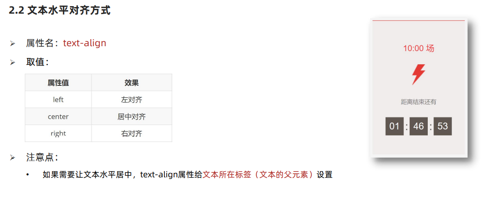
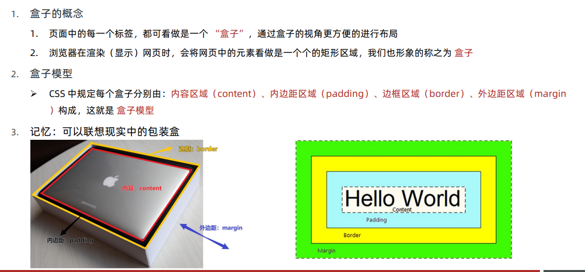
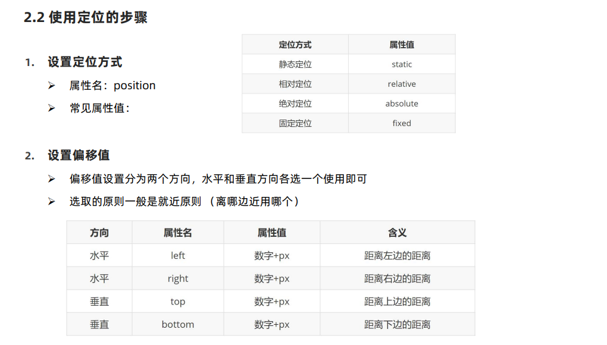
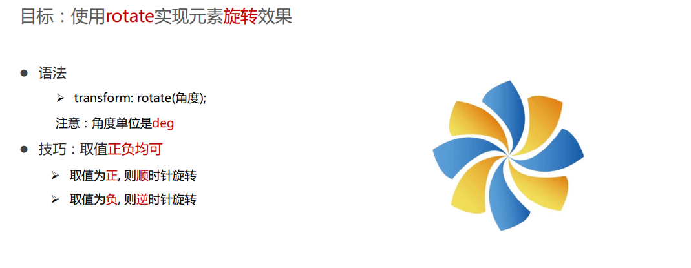

# HTML

- HTML（Hyper Text Markup Language）中文译为：超文本标记语言
- 专门用于网页开发的语言，主要通过 HTML 标签对网页中的文本、图片、音频、视频等内容进行描述
  

---

## 基础认知

- 记录了 HTML 的基本构成

---

### Web 标准的构成

| 构成 | 语言       | 说明                                               |
| ---- | ---------- | -------------------------------------------------- |
| 结构 | HTML       | 页面元素和内容                                     |
| 表现 | CSS        | 网页元素的外观和位置等页面样式（如：颜色、大小等） |
| 行为 | JavaScript | 网页模型的定义与页面交互                           |
|      |

---

### HTML 骨架结构

- html 标签：网页的整体
- head 标签：网页的头部
- body 标签：网页的身体
- title 标签：网页的标题

---

### HTML 标签的结构

1. 标签由<、>、/、英文单词或字母组成。并且把标签中<>包括起来的英文单词或字母称为标签名
2. 常见标签由两部分组成，我们称之为：双标签。前部分叫开始标签，后部分叫结束标签，两部分之间包裹内容
3. 少数标签由一部分组成，我们称之为：单标签。自成一体，无法包裹内容

---

### HTML 标签的属性

1. 标签的属性写在开始标签内部
2. 标签上可以同时存在多个属性
3. 属性之间以空格隔开
4. 标签名与属性之间必须以空格隔开
5. 属性之间没有顺序之分

---

### 网页与网站的关系

---

### 骨架结构标签

---

### SEO 三大标签

---

### ico 图标设置

---

### 版心

---

### 文本格式化标签

| 标签   | 说明   |
| ------ | ------ |
| b      | 加粗   |
| u      | 下划线 |
| i      | 倾斜   |
| s      | 删除线 |
| strong | 加粗   |
| ins    | 下划线 |
| em     | 倾斜   |
| del    | 删除线 |

---

## HTML 标签

- 记录了一些不经常使用容易忘的标签及属性

---

### 音频标签

- 场景：在页面中插入音频
- 代码：`<audio src="" controls></audio>`
- 常见属性：
  |属性名|功能|
  |---|---|
  |src|音频的路径|
  |controls|显示播放的控件|
  |autoplay|自动播放(部分浏览器不支持)|
  |loop|循环播放|

---

### 视频标签

- 场景：在页面中插入视频
- 代码：`<video src="" controls></video>`
- 常见属性：
  |属性名|功能|
  |---|---|
  |src|视频的路径|
  |controls|显示播放的控件|
  |autoplay|自动播放(Chrome 需要配合 muted 实现静音播放)|
  |loop|循环播放|

---

### 链接标签

- 场景：：点击之后，从一个页面跳转到另一个页面
- 代码：`<a href="javascript:;">空链接</a>`
- target 属性：
  |取值|效果|
  |---|---|
  |\_self|默认值，在当前窗口中跳转|
  |\_blank|在新窗口中跳转|

---

### 列表标签

- 场景：在网页中按照行展示关联性的内容，如：新闻列表、排行榜、账单等
- 特点：按照行的方式，整齐显示内容
- 种类：无序列表、有序列表、自定义列表
- 无序列表：
  |标签名|说明|
  |---|---|
  |ul|无序列表的整体，用于包裹 li 标签|
  |li|表示无序列表的每一项，用于包含每一行的内容|

  - 列表的每一项前默认显示圆点标识
  - ul 标签中只允许包含 li 标签
  - li 标签可以包含任意内容

- 有序列表：
  |标签名|说明|
  |---|---|
  |ol|有序列表的整体，用于包裹 li 标签|
  |li|表示有序列表的每一项，用于包含每一行的内容|

  - 列表的每一项前默认显示序号标识
  - ol 标签中只允许包含 li 标签
  - li 标签可以包含任意内容

- 自定义列表：
  |标签名|说明|
  |---|---|
  |dl|自定义列表的整体，用于包裹 dt/dd 标签|
  |dt|表示自定义列表的主题|
  |dd|表示自定义列表的针对主题的每一项内容|

  - dd 前会默认显示缩进效果
  - dl 标签中只允许包含 dt/dd 标签
  - dt/dd 标签可以包含任意内容

---

### 表格标签

---

### 表单标签

---

### 语义化标签

---

### 字符实体

# CSS

- CSS：层叠样式表（Cascading style sheets）
- CSS 作用:给页面中的 HTML 标签设置样式
  

---

## 基础认知

- 记录了 CSS 基本使用方法

---

### CSS 引入方式

- 内嵌式：CSS 写在 style 标
  - 提示：style 标签虽然可以写在页面任意位置，但是通常约定写在 head 标签中
- 外联式：CSS 写在一个单独的.css 文件中
  - 提示：需要通过 link 标签在网页中引入
- 行内式：CSS 写在标签的 style 属
  - 提示：基础班不推荐使用，之后会配合 js 使用
    

---

### 基础选择器

---

## 元素属性

- 记录了一些元素的属性和值

---

### 字体和文本样式

---

### 背景相关属性

---

## 选择器进阶

---

### 复合选择器

---

### 并集选择器

---

### 交集选择器

---

### Emmet 语法

---

### hover 伪类选择器

---

### 链接伪类选择器

---

### 焦点伪类选择器

---

### 属性选择器

---

## 元素显示模式

- 三种常见的元素显示模式

---

### 块级元素

---

### 行内元素

---

### 行内块元素

---

### 元素显示模式转换

---

## CSS 三大特性

- CSS 的继承和层叠特性，计算 CSS 的优先级和权重比较

---

### 继承性

---

### 层叠性

---

### 优先级

---

### 权重叠加计算

---

## 盒子模型

-盒子模型的组成，盒子模型边框边框、内边距、外边距的设置方法

---

### 盒子模型的介绍

---

### 内容区域的宽度和高度

---

### 边框（border）

---

### 内边距（padding）

---

### 盒子实际大小终极计算公式

---

### CSS3 盒模型（自动内减）

---

### 外边距（margin）

---

### 盒子阴影

---

### 外边距折叠现象

---

## 伪元素

---

## 标准流

---

## 浮动

---

## 清除浮动

---

## BFC 的介绍

---

## 定位

---

### 定位的基本介绍

---

### 定位的基本使用

---

### 静态定位

---

### 相对定位

---

### 绝对定位

---

### 子绝父相

---

### 固定定位

---

### 元素的层级关系

---

## 装饰

---

### 垂直对齐方式

---

### 光标类型

---

### 边框圆角

---

### overflow 溢出部分显示效果

---

### 元素本身隐藏

---

## 精灵图

---

## CSS 书写顺序

---

## 平面空间转换

---

### 过渡

---

### 位移

---

### 旋转

---

### 缩放

---

### 透视

---

### 立体呈现

---

### 动画

-实现多个状态间的变化过程，动画过程可控（重复播放、最终画面、是否暂停）

