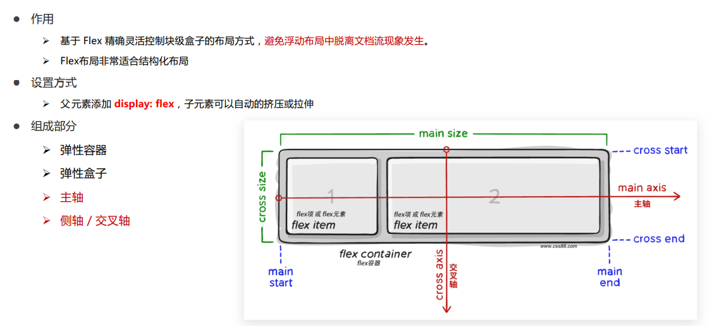
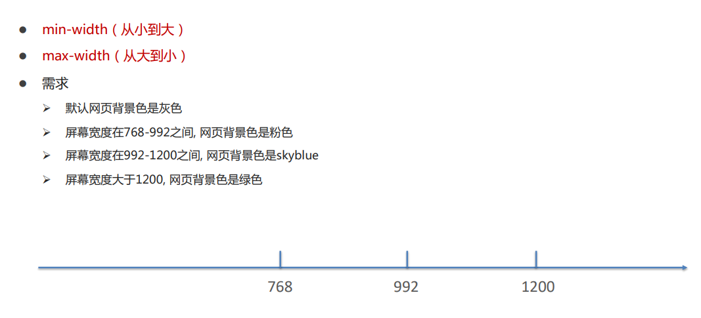

# 移动 Web

---

## 移动端特点

- 区别：
  - PC 屏幕大，网页固定版心
  - 手机屏幕小， 网页宽度多数为 100%

---

### 分辨率

---

### 视口

---

### 二倍图

---

## Flex 布局

- Flex 布局/弹性布局：
  - 是一种浏览器提倡的布局模型
  - 布局网页更简单、灵活
  - 避免浮动脱标的问题

---

### Flex 布局模型构成

---

### 主轴对齐方式

---

### 侧轴对齐方式

---

### 主轴方向

---

### 弹性盒子换行

---

## 移动适配

- 自适应大小
  

---

### rem 移动适配

---

#### 媒体查询

---

#### 适配原理

---

### flexible

---
