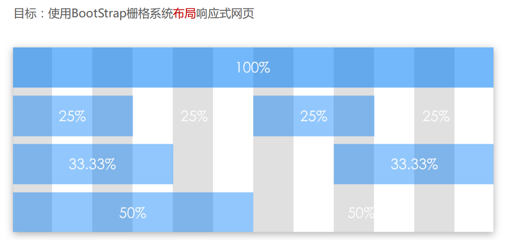
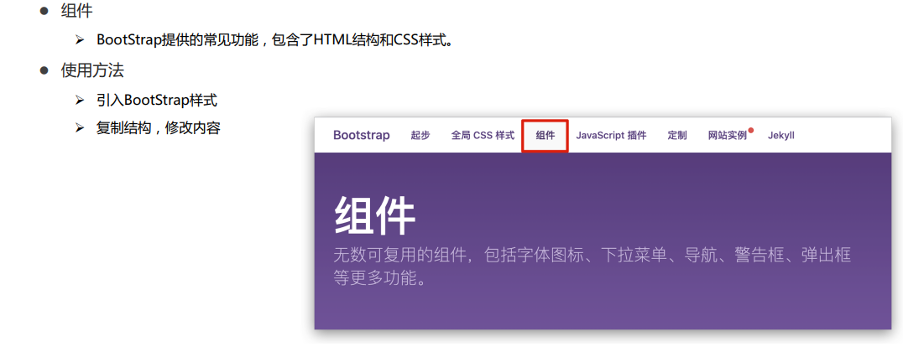

# 简介

- Bootstrap 是由 Twitter 公司开发维护的前端 UI 框架，它提供了大量编写好的 CSS 样式，允许开发者结合一定
  HTML 结构及 JavaScript，快速编写功能完善的网页及常见交互效果
- 中文官网: https://www.bootcss.com/

---

## 使用步骤

---

## 栅格系统

---

## 全局样式

---

## 组件

---

## Glyphicons 字体图标

---

## 插件

---

## 定制

