# jQuery

​ JavaScript 库：即 library，是一个封装好的特定的集合（方法和函数）。从封装一大堆函数的角度理解库，就是在这个库中，封装了很多预先定义好的函数在里面，比如动画 animate、hide、show，比如获取元素等。

> 简单理解： 就是一个 JS 文件，里面对我们原生 js 代码进行了封装，存放到里面。这样我们可以快速高效的使用这些封装好的功能了。
>
> 比如 jQuery，就是为了快速方便的操作 DOM，里面基本都是函数（方法）。

- jQuery 封装了 JavaScript 常用的功能代码，优化了 DOM 操作、事件处理、动画设计和 Ajax 交互。

## jQuery 基础

    jQuery中常见的两种入口函数：

```javascript
// 第一种: 简单易用。
$(function () {
    ...  // 此处是页面 DOM 加载完成的入口
}) ;

// 第二种: 繁琐，但是也可以实现
$(document).ready(function(){
   ...  //  此处是页面DOM加载完成的入口
});
```

1. 等着 DOM 结构渲染完毕即可执行内部代码，不必等到所有外部资源加载完成，jQuery 帮我们完成了封装。
2. 相当于原生 js 中的 DOMContentLoaded。
3. 不同于原生 js 中的 load 事件是等页面文档、外部的 js 文件、css 文件、图片加载完毕才执行内部代码。

### jQuery 中的顶级对象$

1.  \$是 jQuery 的别称，在代码中可以使用 jQuery 代替，但一般为了方便，通常都直接使用 $ 。
2.  \$是 jQuery 的顶级对象，相当于原生 JavaScript 中的 window。把元素利用$包装成 jQuery 对象，就可以调用 jQuery 的方法。

### jQuery 对象和 DOM 对象

1. 用原生 JS 获取来的对象就是 DOM 对象
2. jQuery 方法获取的元素就是 jQuery 对象。
3. jQuery 对象本质是： 利用$对 DOM 对象包装后产生的对象（伪数组形式存储）。

> 注意：
>
> 只有 jQuery 对象才能使用 jQuery 方法，DOM 对象则使用原生的 JavaScirpt 方法。


### jQuery 对象和 DOM 对象转换

​ DOM 对象与 jQuery 对象之间是可以相互转换的。因为原生 js 比 jQuery 更大，原生的一些属性和方法 jQuery 没有给我们封装. 要想使用这些属性和方法需要把 jQuery 对象转换为 DOM 对象才能使用。

```javascript
// 1.DOM对象转换成jQuery对象，方法只有一种
var box = document.getElementById("box"); // 获取DOM对象
var jQueryObject = $(box); // 把DOM对象转换为 jQuery 对象

// 2.jQuery 对象转换为 DOM 对象有两种方法：
//   2.1 jQuery对象[索引值]
var domObject1 = $("div")[0];

//   2.2 jQuery对象.get(索引值)
var domObject2 = $("div").get(0);
```

## jQuery 选择器

### 基础选择器

```js
$("选择器"); //  里面选择器直接写 CSS 选择器即可，但是要加引号
```

​ 

### 层级选择器

​ 层级选择器最常用的两个分别为：后代选择器和子代选择器。

​ 

### 筛选选择器


jQuery 中还有一些筛选方法，类似 DOM 中的通过一个节点找另外一个节点，父、子、兄以外有所加强。


## jQuery 样式操作

### 操作 css 方法

​ jQuery 可以使用 css 方法来修改简单元素样式； 也可以操作类，修改多个样式。

​ 常用以下三种形式 :

```javascript
// 1.参数只写属性名，则是返回属性值
var strColor = $(this).css('color');

// 2.  参数是属性名，属性值，逗号分隔，是设置一组样式，属性必须加引号，值如果是数字可以不用跟单位和引号
$(this).css(''color'', ''red'');

// 3.  参数可以是对象形式，方便设置多组样式。属性名和属性值用冒号隔开， 属性可以不用加引号
$(this).css({ "color":"white","font-size":"20px"});

```

### 设置类样式方法

​ 作用等同于以前的 classList，可以操作类样式， 注意操作类里面的参数不要加点。

​ 常用的三种设置类样式方法：

```javascript
// 1.添加类
$("div").addClass("current");

// 2.删除类
$("div").removeClass("current");

// 3.切换类
$("div").toggleClass("current");
```

    注意：

1. 设置类样式方法比较适合样式多时操作，可以弥补 css()的不足。
2. 原生 JS 中 className 会覆盖元素原先里面的类名，jQuery 里面类操作只是对指定类进行操作，不影响原先的类名。

## jQuery 效果

### 显示隐藏

​ 显示隐藏动画，常见有三个方法：show() / hide() / toggle() ;

​ 语法规范如下:


### 滑入滑出

​ 滑入滑出动画，常见有三个方法：slideDown() / slideUp() / slideToggle() ;

​ 语法规范如下:


### 淡入淡出

​ 淡入淡出动画，常见有四个方法：fadeIn() / fadeOut() / fadeToggle() / fadeTo() ;

​ 语法规范如下:


### 自定义动画

​ 自定义动画非常强大，通过参数的传递可以模拟以上所有动画，方法为：animate() ;

​ 语法规范如下:


### 停止动画排队

​ 动画或者效果一旦触发就会执行，如果多次触发，就造成多个动画或者效果排队执行。

​ 停止动画排队的方法为：stop() ;

- stop() 方法用于停止动画或效果。
- stop() 写到动画或者效果的前面， 相当于停止结束上一次的动画。

### 事件切换

​ jQuery 中为我们添加了一个新事件 hover() ; 功能类似 css 中的伪类 :hover 。介绍如下

**语法**

```javascript
hover([over,]out)     // 其中over和out为两个函数
```

- over:鼠标移到元素上要触发的函数（相当于 mouseenter）
- out:鼠标移出元素要触发的函数（相当于 mouseleave）
- 如果只写一个函数，则鼠标经过和离开都会触发它

## jQuery 属性操作

### 元素固有属性值 prop()

​ 所谓元素固有属性就是元素本身自带的属性，比如 <a> 元素里面的 href ，比如 <input> 元素里面的 type。

**语法**


​ 注意：prop() 除了普通属性操作，更适合操作表单属性：disabled / checked / selected 等。

### 元素自定义属性值 attr()

    用户自己给元素添加的属性，我们称为自定义属性。 比如给 div 添加 index =“1”。

**语法**


​ 注意：attr() 除了普通属性操作，更适合操作自定义属性。（该方法也可以获取 H5 自定义属性）

### 数据缓存 data()

    data() 方法可以在指定的元素上存取数据，并不会修改 DOM 元素结构。一旦页面刷新，之前存放的数据都将被移除。

**语法**


​ 注意：同时，还可以读取 HTML5 自定义属性 data-index ，得到的是数字型。

## jQuery 文本属性值

​ 常见操作有三种：html() / text() / val() ; 分别对应 JS 中的 innerHTML 、innerText 和 value 属性，主要针对元素的内容还有表单的值操作。

**语法**


​ 注意：html() 可识别标签，text() 不识别标签。

## jQuery 元素操作

### 遍历元素

​ jQuery 隐式迭代是对同一类元素做了同样的操作。 如果想要给同一类元素做不同操作，就需要用到遍历。

**语法 1**


​ 注意：此方法用于遍历 jQuery 对象中的每一项，回调函数中元素为 DOM 对象，想要使用 jQuery 方法需要转换。

**语法 2**


​ 注意：此方法用于遍历 jQuery 对象中的每一项，回调函数中元素为 DOM 对象，想要使用 jQuery 方法需要转换。

### 创建、添加、删除

​ jQuery 方法操作元素的创建、添加、删除方法很多，则重点使用部分，如下：

**语法总和**


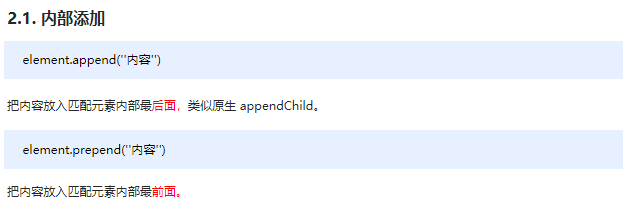


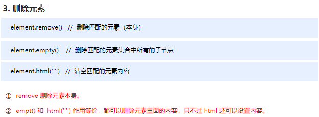

​ 注意：以上只是元素的创建、添加、删除方法的常用方法，其他方法请参详 API。

## jQuery 尺寸、位置操作

### jQuery 尺寸操作

​ jQuery 尺寸操作包括元素宽高的获取和设置，且不一样的 API 对应不一样的盒子模型。

**语法**


### jQuery 位置操作

​ jQuery 的位置操作主要有三个： offset()、position()、scrollTop()/scrollLeft() , 具体介绍如下:

**语法**


## jQuery 事件注册

    jQuery 为我们提供了方便的事件注册机制，是开发人员抑郁操作优缺点如下：

- 优点: 操作简单，且不用担心事件覆盖等问题。
- 缺点: 普通的事件注册不能做事件委托，且无法实现事件解绑，需要借助其他方法。

**语法**


## jQuery 事件处理

### on() 绑定事件

​ 因为普通注册事件方法的不足，jQuery 又创建了多个新的事件绑定方法 bind() / live() / delegate() / on()等，其中最好用的是: on()

**语法**


### off() 解绑事件

​ 当某个事件上面的逻辑，在特定需求下不需要的时候，可以把该事件上的逻辑移除，这个过程我们称为事件解绑。jQuery 为我们提供 了多种事件解绑方法：die() / undelegate() / off() 等，甚至还有只触发一次的事件绑定方法 one()，在这里我们重点讲解一下 off() ;

**语法**


### trigger() 自动触发事件

​ 有些时候，在某些特定的条件下，我们希望某些事件能够自动触发, 比如轮播图自动播放功能跟点击右侧按钮一致。可以利用定时器自动触发右侧按钮点击事件，不必鼠标点击触发。由此 jQuery 为我们提供了两个自动触发事件 trigger() 和 triggerHandler() ;

**语法**

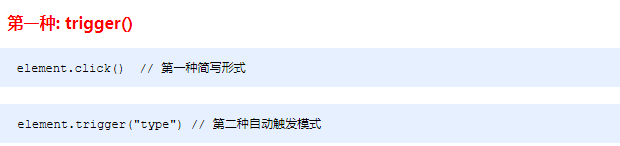


## jQuery 事件对象

​ jQuery 对 DOM 中的事件对象 event 进行了封装，兼容性更好，获取更方便，使用变化不大。事件被触发，就会有事件对象的产生。

**语法**


## jQuery 拷贝对象

​ jQuery 中分别为我们提供了两套快速获取和设置元素尺寸和位置的 API，方便易用，内容如下。

**语法**


## jQuery 多库共存

​ 实际开发中，很多项目连续开发十多年，jQuery 版本不断更新，最初的 jQuery 版本无法满足需求，这时就需要保证在旧有版本正常运行的情况下，新的功能使用新的 jQuery 版本实现，这种情况被称为，jQuery 多库共存。

**语法**


## jQuery 插件

​ jQuery 插件常用的网站：

1.  jQuery 插件库 http://www.jq22.com/
2.  jQuery 之家 http://www.htmleaf.com/

jQuery 插件使用步骤：

3.  引入相关文件。（jQuery 文件 和 插件文件）
4.  复制相关 html、css、js (调用插件)。

# Ajax

## 客户端与服务器


## URL 地址

- URL（全称是 UniformResourceLocator）中文叫统一资源定位符，用于标识互联网上每个资源的唯一存放位置。
- 浏览器只有通过 URL 地址，才能正确定位资源的存放位置，从而成功访问到对应的资源。

<br>

- URL 地址一般由三部组成：
- ① 客户端与服务器之间的通信协议
- ② 存有该资源的服务器名称
- ③ 资源在服务器上具体的存放位置
  

## 客户端与服务器的通信过程


## jQuery 中的 Ajax

- Ajax 的全称是 Asynchronous Javascript And XML（异步 JavaScript 和 XML）。
- 通俗的理解：在网页中利用 XMLHttpRequest 对象和服务器进行数据交互的方式，就是 Ajax。
- 浏览器中提供的 XMLHttpRequest 用法比较复杂，所以 jQuery 对 XMLHttpRequest 进行了封装，提供了一系列 Ajax 相关的函数，极大地降低了 Ajax 的使用难度。
- jQuery 中发起 Ajax 请求最常用的三个方法如下：
- $.get()
- $.post()
- $.ajax()

### $.get()函数的语法


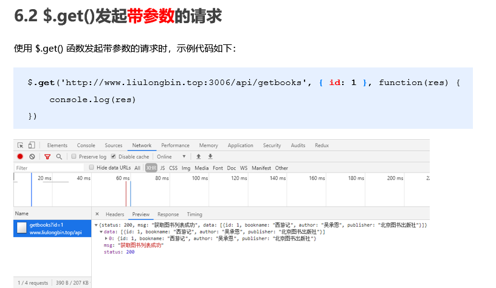

### $.post()函数的语法


### $.ajax()函数的语法


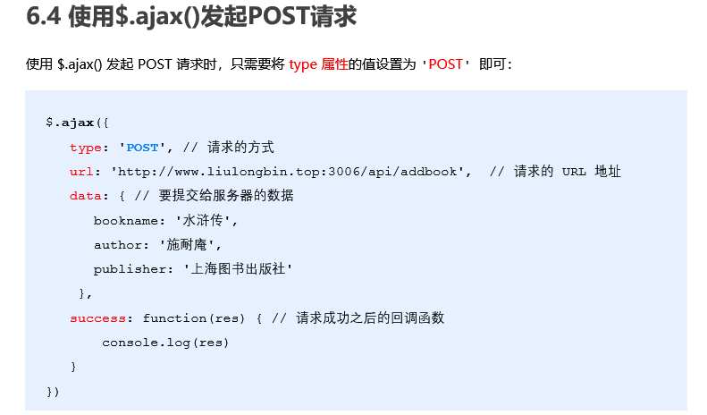

## XMLHttpRequest 的基本使用


### 使用 xhr 发起 GET 请求


### xhr 发起 POST 请求


### xhr 对象的 readyState 属性


### 查询字符串


### URL 编码与解码


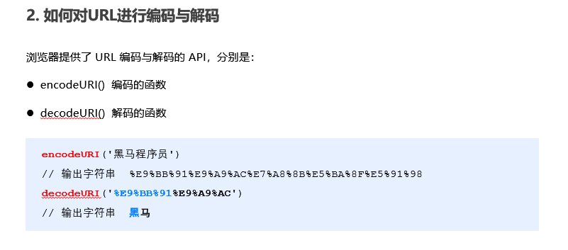


## 数据交换格式

- 数据交换格式，就是服务器端与客户端之间进行数据传输与交换的格式。
- 前端领域，经常提及的两种数据交换格式分别是 XML 和 JSON。其中 XML 用的非常少，所以，我们重点要学习的数据交换格式就是 JSON。
  

### XML


### JSON

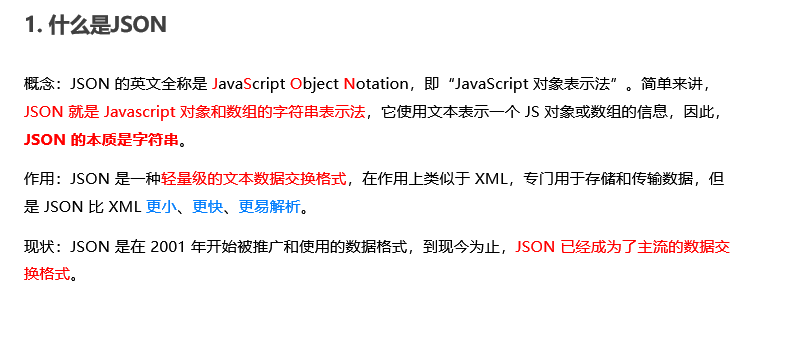

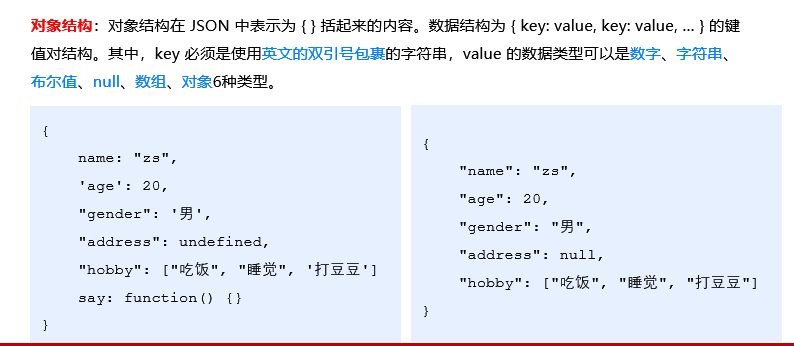


## 封装自己的 Ajax 函数


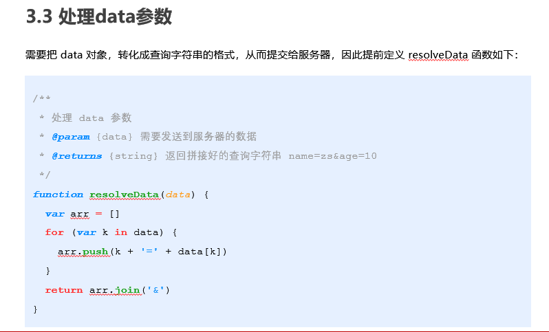


## XMLHttpRequest Level2 的新特性

- 旧版 XMLHttpRequest 的缺点
  - 只支持文本数据的传输，无法用来读取和上传文件
  - 传送和接收数据时，没有进度信息，只能提示有没有完成
- XMLHttpRequest Level2 的新功能
  - 可以设置 HTTP 请求的时限
  - 可以使用 FormData 对象管理表单数据
  - 可以上传文件
  - 可以获得数据传输的进度信息

### 设置 HTTP 请求时限


### FormData 对象管理表单数据


### 上传文件

1. 定义 UI 结构
2. 验证是否选择了文件
3. 向 FormData 中追加文件
4. 使用 xhr 发起上传文件的请求
5. 监听 onreadystatechange 事件
   
   
   
   
   

### 显示文件上传进度

- 新版本的 XMLHttpRequest 对象中，可以通过监听 xhr.upload.onprogress 事件，来获取到文件的上传进度。
- 语法格式如下：
  
  
  
  
  

## jQuery 高级用法

### jQuery 实现文件上传


### jQuery 实现 loading 效果


## axios

- Axios 是专注于网络数据请求的库。
- 相比于原生的 XMLHttpRequest 对象，axios 简单易用。
- 相比于 jQuery，axios 更加轻量化，只专注于网络数据请求。

### axios 发起 GET 请求


### axios 发起 POST 请求


### 直接使用 axios 发起请求


## 接口

- 使用 Ajax 请求数据时，被请求的 URL 地址，就叫做数据接口（简称接口）。同时，每个接口必须有请求方式。
- 例如：
  - http://www.liulongbin.top:3006/api/getbooks 获取图书列表的接口(GET 请求)
  - http://www.liulongbin.top:3006/api/addbook 添加图书的接口（POST 请求）

### 接口的请求过程


### 接口测试工具

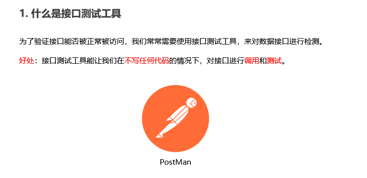


### 接口文档


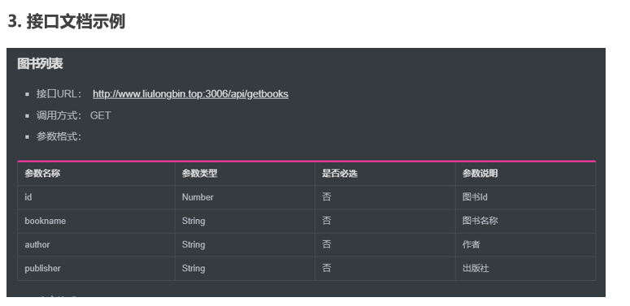


## form 表单的基本使用


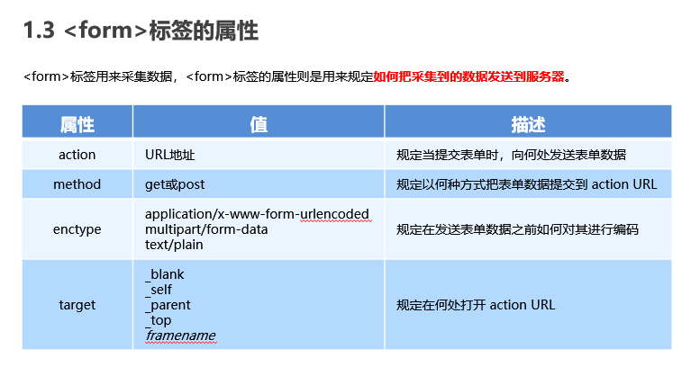


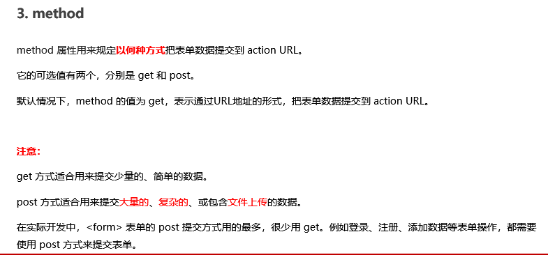


### 表单的同步提交及缺点

- 通过点击 submit 按钮，触发表单提交的操作，从而使页面跳转到 action URL 的行为，叫做表单的同步提交。
- 表单同步提交的缺点
  - `<form>`表单同步提交后，整个页面会发生跳转，跳转到 action URL 所指向的地址，用户体验很差。
  - `<form>`表单同步提交后，页面之前的状态和数据会丢失。
- 如果使用表单提交数据，则会导致以下两个问题：

  - 页面会发生跳转
  - 页面之前的状态和数据会丢失

- 解决方案：表单只负责采集数据，Ajax 负责将数据提交到服务器。

## Ajax 提交表单数据

### 监听表单提交事件


### 阻止表单默认提交行为


### 快速获取表单中的数据


## art-template 模板引擎

- art-template 是一个简约、超快的模板引擎。中文官网首页为 http://aui.github.io/art-template/zh-cn/index.html

### art-template 模板引擎的基本使用

- 导入 art-template
- 定义数据
- 定义模板
- 调用 template 函数
- 渲染 HTML 结构

### art-template 标准语法

- art-template 提供了 {{ }} 这种语法格式，在 {{ }} 内可以进行变量输出，或循环数组等操作，这种 {{ }} 语法在 art-template 中被称为标准语法。
  
  
  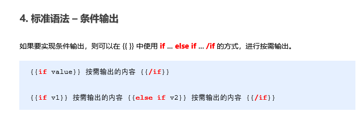
  
  
  
  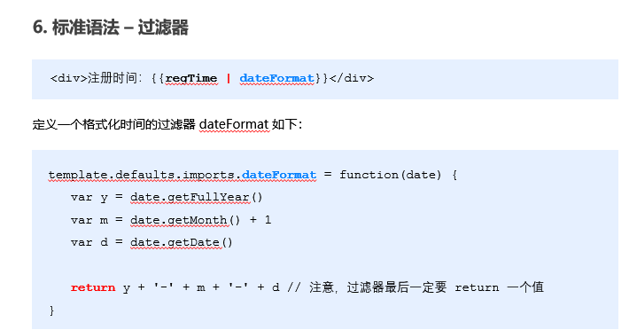

### 模板引擎的实现原理

- 正则与字符串操作
  
  
  
  
  
  

### 实现简易的模板引擎

- 实现步骤
  - 定义模板结构
  - 预调用模板引擎
  - 封装 template 函数
  - 导入并使用自定义的模板引擎
    
    
    
    

## 同源策略


## 跨域


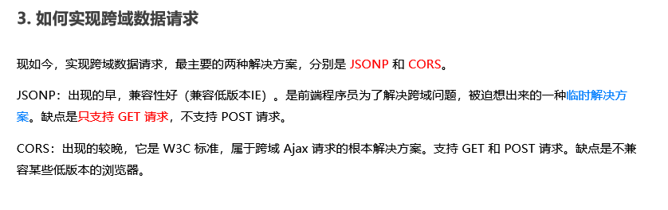

## JSONP

- JSONP (JSON with Padding) 是 JSON 的一种“使用模式”，可用于解决主流浏览器的跨域数据访问的问题。

### JSONP 的实现原理

- 由于浏览器同源策略的限制，网页中无法通过 Ajax 请求非同源的接口数据。但是 `<script>` 标签不受浏览器同源策略的影响，可以通过 src 属性，请求非同源的 js 脚本。
- 因此，JSONP 的实现原理，就是通过 `<script>` 标签的 src 属性，请求跨域的数据接口，并通过函数调用的形式，接收跨域接口响应回来的数据。

### 自己实现一个简单的 JSONP


### JSONP 的缺点

- 由于 JSONP 是通过 `<script>` 标签的 src 属性，来实现跨域数据获取的，所以，JSONP 只支持 GET 数据请求，不支持 POST 请求。
- 注意：JSONP 和 Ajax 之间没有任何关系，不能把 JSONP 请求数据的方式叫做 Ajax，因为 JSONP 没有用到 XMLHttpRequest 这个对象。

### jQuery 中的 JSONP


### 自定义参数及回调函数名称


### jQuery 中 JSONP 的实现过程

- jQuery 中的 JSONP，也是通过 `<script>` 标签的 src 属性实现跨域数据访问的，只不过，jQuery 采用的是动态创建和移除 `<script>` 标签的方式，来发起 JSONP 数据请求。
- 在发起 JSONP 请求的时候，动态向 `<header>` 中 append 一个 `<script> `标签；
- 在 JSONP 请求成功以后，动态从 `<header>` 中移除刚才 append 进去的 `<script>` 标签；

## 防抖

- 防抖策略（debounce）是当事件被触发后，延迟 n 秒后再执行回调，如果在这 n 秒内事件又被触发，则重新计时。
- 用户在输入框中连续输入一串字符时，可以通过防抖策略，只在输入完后，才执行查询的请求，这样可以有效减少请求次数，节约请求资源；
  

## 节流

- 节流策略（throttle），顾名思义，可以减少一段时间内事件的触发频率。
- 鼠标连续不断地触发某事件（如点击），只在单位时间内只触发一次；
- 懒加载时要监听计算滚动条的位置，但不必每次滑动都触发，可以降低计算的频率，而不必去浪费 CPU 资源；
  

## HTTP 协议

- HTTP 协议即超文本传送协议 (HyperText Transfer Protocol) ，它规定了客户端与服务器之间进行网页内容传输时，所必须遵守的传输格式。
- 例如：
  - 客户端要以 HTTP 协议要求的格式把数据提交到服务器
  - 服务器要以 HTTP 协议要求的格式把内容响应给客户端
    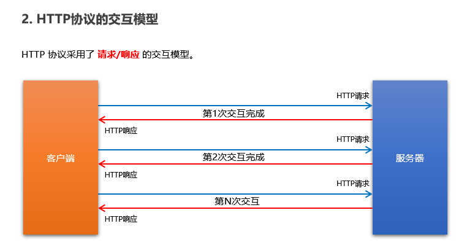
    
    
    
    
    
    

### HTTP 请求消息


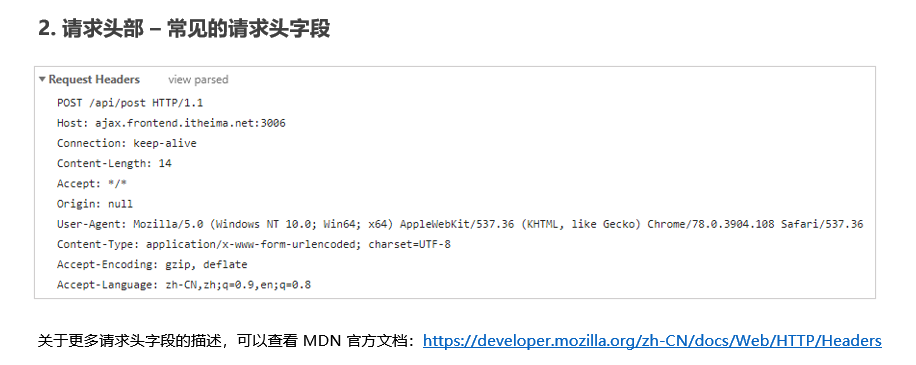


### HTTP 响应消息


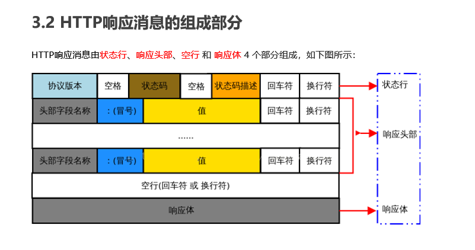
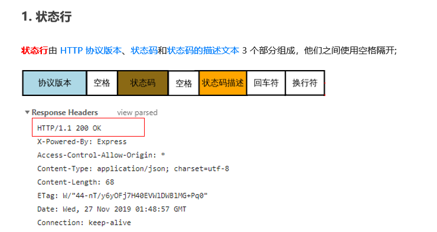


### HTTP 请求方法

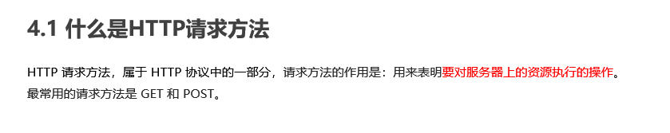
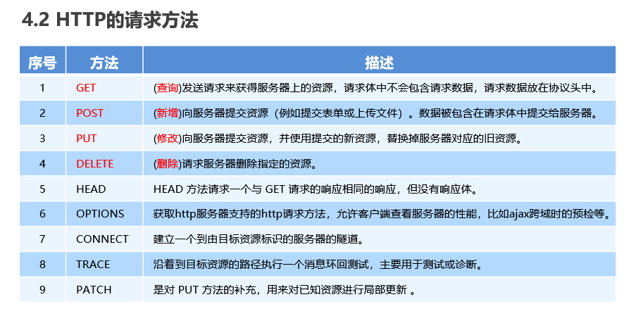

### HTTP 响应状态代码


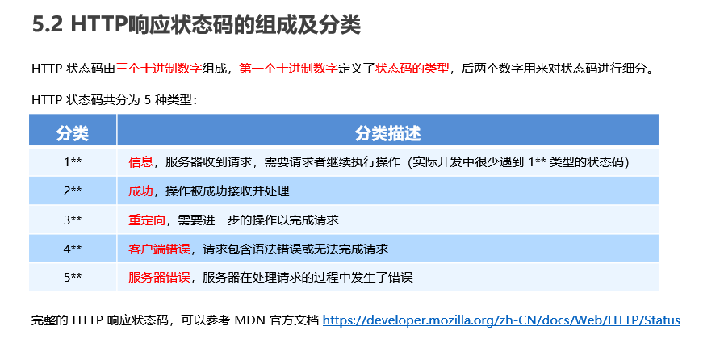

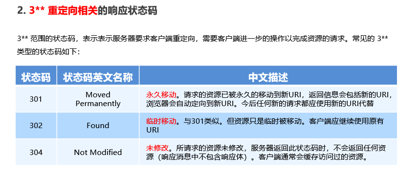

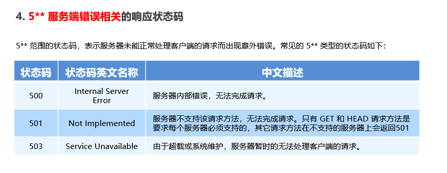
